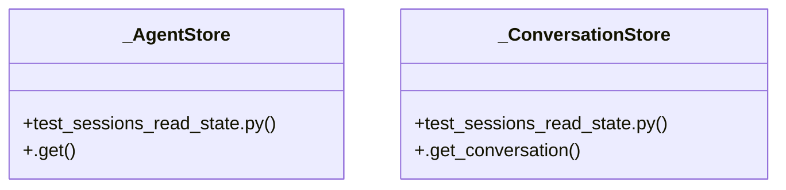

# Community 65

> 27 nodes · cohesion 0.11

## Key Concepts

- [test_sessions_read_state.py](file:///C:/Users/1/github-pr/agent-meow/tests/server/routes/test_sessions_read_state.py#L1) (13 connections)
- [_build_app()](file:///C:/Users/1/github-pr/agent-meow/tests/server/routes/test_sessions_read_state.py#L46) (9 connections)
- [test_put_mark_seen_clears_unread_and_advances_baseline()](file:///C:/Users/1/github-pr/agent-meow/tests/server/routes/test_sessions_read_state.py#L119) (7 connections)
- [_build_item()](file:///C:/Users/1/github-pr/agent-meow/tests/server/routes/test_sessions_read_state.py#L78) (6 connections)
- [_make_conversation()](file:///C:/Users/1/github-pr/agent-meow/tests/server/routes/test_sessions_read_state.py#L66) (6 connections)
- [test_list_item_embeds_viewer_read_state()](file:///C:/Users/1/github-pr/agent-meow/tests/server/routes/test_sessions_read_state.py#L134) (6 connections)
- [test_read_state_is_scoped_per_user()](file:///C:/Users/1/github-pr/agent-meow/tests/server/routes/test_sessions_read_state.py#L151) (6 connections)
- [_AgentStore](file:///C:/Users/1/github-pr/agent-meow/tests/server/routes/test_sessions_read_state.py#L38) (5 connections)
- [_ConversationStore](file:///C:/Users/1/github-pr/agent-meow/tests/server/routes/test_sessions_read_state.py#L30) (5 connections)
- [test_put_mark_unread_returns_204_and_updates_cache()](file:///C:/Users/1/github-pr/agent-meow/tests/server/routes/test_sessions_read_state.py#L103) (5 connections)
- [test_list_item_defaults_when_user_never_saw_session()](file:///C:/Users/1/github-pr/agent-meow/tests/server/routes/test_sessions_read_state.py#L144) (4 connections)
- [_reset_read_state()](file:///C:/Users/1/github-pr/agent-meow/tests/server/routes/test_sessions_read_state.py#L94) (3 connections)
- [.get()](file:///C:/Users/1/github-pr/agent-meow/tests/server/routes/test_sessions_read_state.py#L41) (2 connections)
- [.get_conversation()](file:///C:/Users/1/github-pr/agent-meow/tests/server/routes/test_sessions_read_state.py#L33) (2 connections)
- [Tests for the per-user read-state feature:    * ``PUT /v1/sessions/{session_id](file:///C:/Users/1/github-pr/agent-meow/tests/server/routes/test_sessions_read_state.py#L1) (2 connections)
- [Marking unread persists the baseline + override and returns 204.](file:///C:/Users/1/github-pr/agent-meow/tests/server/routes/test_sessions_read_state.py#L104) (2 connections)
- [Marking seen (unread=false) drops the override and moves last_seen up.](file:///C:/Users/1/github-pr/agent-meow/tests/server/routes/test_sessions_read_state.py#L120) (2 connections)
- [``_build_session_list_item`` reflects the caller's read-state.](file:///C:/Users/1/github-pr/agent-meow/tests/server/routes/test_sessions_read_state.py#L135) (2 connections)
- [A session the user never touched has no baseline and reads as seen.](file:///C:/Users/1/github-pr/agent-meow/tests/server/routes/test_sessions_read_state.py#L145) (2 connections)
- [One user's read-state doesn't leak into another user's list items.](file:///C:/Users/1/github-pr/agent-meow/tests/server/routes/test_sessions_read_state.py#L152) (2 connections)
- [Conversation store stub — unused by the PUT when auth is off.](file:///C:/Users/1/github-pr/agent-meow/tests/server/routes/test_sessions_read_state.py#L31) (2 connections)
- [Return ``None`` (no conversation lookups happen without auth).](file:///C:/Users/1/github-pr/agent-meow/tests/server/routes/test_sessions_read_state.py#L34) (2 connections)
- [Agent store stub — present only to satisfy the router factory.](file:///C:/Users/1/github-pr/agent-meow/tests/server/routes/test_sessions_read_state.py#L39) (2 connections)
- [Build a FastAPI app exposing the sessions router with no auth.](file:///C:/Users/1/github-pr/agent-meow/tests/server/routes/test_sessions_read_state.py#L47) (2 connections)
- [A minimal session-shaped conversation for the list-item builder.](file:///C:/Users/1/github-pr/agent-meow/tests/server/routes/test_sessions_read_state.py#L67) (2 connections)
- *... and 2 more nodes in this community*

## Class Diagram

## Relationships

- No strong cross-community connections detected

## Source Files

- [C:\Users\1\github-pr\agent-meow\tests\server\routes\test_sessions_read_state.py](file:///C:/Users/1/github-pr/agent-meow/tests/server/routes/test_sessions_read_state.py)

## Audit Trail

- EXTRACTED: 79 (75%)
- INFERRED: 26 (25%)
- AMBIGUOUS: 0 (0%)

---

*Part of the graphify knowledge wiki. See [[index]] to navigate.*