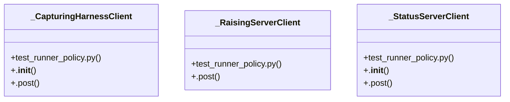

# Community 69

> 25 nodes · cohesion 0.12

## Key Concepts

- [test_runner_policy.py](file:///C:/Users/1/github-pr/agent-meow/tests/runner/test_runner_policy.py#L1) (10 connections)
- [_run()](file:///C:/Users/1/github-pr/agent-meow/tests/runner/test_runner_policy.py#L55) (10 connections)
- [_CapturingHarnessClient](file:///C:/Users/1/github-pr/agent-meow/tests/runner/test_runner_policy.py#L44) (7 connections)
- [_StatusServerClient](file:///C:/Users/1/github-pr/agent-meow/tests/runner/test_runner_policy.py#L33) (7 connections)
- [_RaisingServerClient](file:///C:/Users/1/github-pr/agent-meow/tests/runner/test_runner_policy.py#L26) (5 connections)
- [test_tool_call_error_fails_closed()](file:///C:/Users/1/github-pr/agent-meow/tests/runner/test_runner_policy.py#L75) (5 connections)
- [test_non_tool_call_phase_error_fails_open()](file:///C:/Users/1/github-pr/agent-meow/tests/runner/test_runner_policy.py#L89) (4 connections)
- [test_success_deny_verdict_passed_through()](file:///C:/Users/1/github-pr/agent-meow/tests/runner/test_runner_policy.py#L108) (4 connections)
- [test_success_verdict_is_passed_through_unchanged()](file:///C:/Users/1/github-pr/agent-meow/tests/runner/test_runner_policy.py#L101) (4 connections)
- [test_tool_call_non_200_fails_closed()](file:///C:/Users/1/github-pr/agent-meow/tests/runner/test_runner_policy.py#L82) (4 connections)
- [.post()](file:///C:/Users/1/github-pr/agent-meow/tests/runner/test_runner_policy.py#L50) (3 connections)
- [.post()](file:///C:/Users/1/github-pr/agent-meow/tests/runner/test_runner_policy.py#L40) (2 connections)
- [.__init__()](file:///C:/Users/1/github-pr/agent-meow/tests/runner/test_runner_policy.py#L47) (1 connections)
- [.post()](file:///C:/Users/1/github-pr/agent-meow/tests/runner/test_runner_policy.py#L29) (1 connections)
- [Tests for ``_evaluate_policy_via_omnigent`` fail-open / fail-closed.  The runn](file:///C:/Users/1/github-pr/agent-meow/tests/runner/test_runner_policy.py#L1) (1 connections)
- [A 200 response is honored verbatim — the default never overrides it.](file:///C:/Users/1/github-pr/agent-meow/tests/runner/test_runner_policy.py#L102) (1 connections)
- [A real DENY from the server is delivered as-is with its reason.](file:///C:/Users/1/github-pr/agent-meow/tests/runner/test_runner_policy.py#L109) (1 connections)
- [Server client whose ``/policies/evaluate`` POST always errors.](file:///C:/Users/1/github-pr/agent-meow/tests/runner/test_runner_policy.py#L27) (1 connections)
- [Server client returning a fixed status (and optional JSON body).](file:///C:/Users/1/github-pr/agent-meow/tests/runner/test_runner_policy.py#L34) (1 connections)
- [Harness client that records the verdict body posted back.](file:///C:/Users/1/github-pr/agent-meow/tests/runner/test_runner_policy.py#L45) (1 connections)
- [Drive the proxy once and return the verdict body posted to the harness.      :](file:///C:/Users/1/github-pr/agent-meow/tests/runner/test_runner_policy.py#L56) (1 connections)
- [A round-trip error on the TOOL_CALL phase yields a DENY verdict.](file:///C:/Users/1/github-pr/agent-meow/tests/runner/test_runner_policy.py#L76) (1 connections)
- [A non-200 from the server on the TOOL_CALL phase yields a DENY verdict.](file:///C:/Users/1/github-pr/agent-meow/tests/runner/test_runner_policy.py#L83) (1 connections)
- [Fail-open is preserved off the TOOL_CALL phase: an error yields ALLOW.      LL](file:///C:/Users/1/github-pr/agent-meow/tests/runner/test_runner_policy.py#L90) (1 connections)
- [.__init__()](file:///C:/Users/1/github-pr/agent-meow/tests/runner/test_runner_policy.py#L36) (1 connections)

## Class Diagram

## Relationships

- No strong cross-community connections detected

## Source Files

- [C:\Users\1\github-pr\agent-meow\tests\runner\test_runner_policy.py](file:///C:/Users/1/github-pr/agent-meow/tests/runner/test_runner_policy.py)

## Audit Trail

- EXTRACTED: 70 (90%)
- INFERRED: 8 (10%)
- AMBIGUOUS: 0 (0%)

---

*Part of the graphify knowledge wiki. See [[index]] to navigate.*