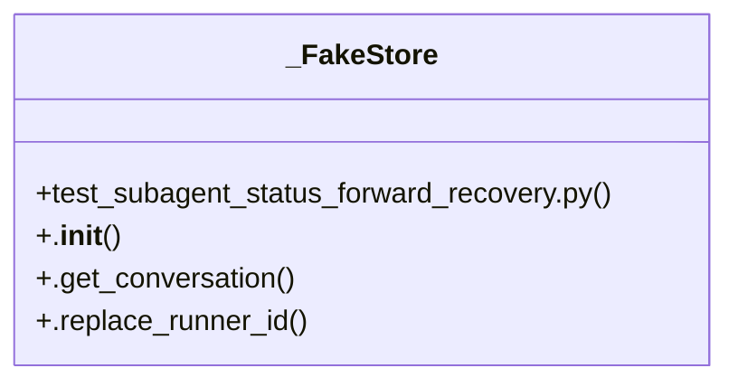

# Community 7

> 2546 nodes · cohesion 0.00

## Key Concepts

- [chunk-NNHCCRGN-DlpIbxXb.js](file:///C:/Users/1/github-pr/agent-meow/agent_meow/server/static/web-ui/assets/chunk-NNHCCRGN-DlpIbxXb.js#L1) (1199 connections)
- [react-dom-CR3QcCjK.js](file:///C:/Users/1/github-pr/agent-meow/agent_meow/server/static/web-ui/assets/react-dom-CR3QcCjK.js#L1) (257 connections)
- [error](file:///C:/Users/1/github-pr/agent-meow/web/src/lib/itemsToBlocks.test.ts#L168) (245 connections)
- [cytoscape.esm-Djp6vQyU.js](file:///C:/Users/1/github-pr/agent-meow/agent_meow/server/static/web-ui/assets/cytoscape.esm-Djp6vQyU.js#L1) (165 connections)
- [dagre-Bx709z4p.js](file:///C:/Users/1/github-pr/agent-meow/agent_meow/server/static/web-ui/assets/dagre-Bx709z4p.js#L1) (149 connections)
- [graphlib-B8gBHxth.js](file:///C:/Users/1/github-pr/agent-meow/agent_meow/server/static/web-ui/assets/graphlib-B8gBHxth.js#L1) (140 connections)
- [object()](file:///C:/Users/1/github-pr/agent-meow/agent_meow/server/static/web-ui/assets/monacoCodeEditor-BzxvY4cV.js#L826) (133 connections)
- [push()](file:///C:/Users/1/github-pr/agent-meow/agent_meow/server/static/web-ui/assets/chunk-NNHCCRGN-DlpIbxXb.js#L148) (130 connections)
- [sequenceDiagram-3UESZ5HK-E9TI1toQ.js](file:///C:/Users/1/github-pr/agent-meow/agent_meow/server/static/web-ui/assets/sequenceDiagram-3UESZ5HK-E9TI1toQ.js#L1) (93 connections)
- [has()](file:///C:/Users/1/github-pr/agent-meow/agent_meow/server/static/web-ui/assets/ordinal-hYBb2elL.js#L1) (93 connections)
- [o](file:///C:/Users/1/github-pr/agent-meow/agent_meow/server/static/web-ui/assets/xychartDiagram-2RQKCTM6-BdxgoKjt.js#L6) (77 connections)
- [node](file:///C:/Users/1/github-pr/agent-meow/web/src/shell/TipTapWorkspaceImage.test.ts#L297) (76 connections)
- [get()](file:///C:/Users/1/github-pr/agent-meow/agent_meow/server/static/web-ui/assets/chunk-NNHCCRGN-DlpIbxXb.js#L149) (63 connections)
- [xychartDiagram-2RQKCTM6-BdxgoKjt.js](file:///C:/Users/1/github-pr/agent-meow/agent_meow/server/static/web-ui/assets/xychartDiagram-2RQKCTM6-BdxgoKjt.js#L1) (62 connections)
- [t()](file:///C:/Users/1/github-pr/agent-meow/agent_meow/server/static/web-ui/assets/chunk-NNHCCRGN-DlpIbxXb.js#L35) (59 connections)
- [chunk-AQP2D5EJ-CKk_eBVd.js](file:///C:/Users/1/github-pr/agent-meow/agent_meow/server/static/web-ui/assets/chunk-AQP2D5EJ-CKk_eBVd.js#L1) (57 connections)
- [e()](file:///C:/Users/1/github-pr/agent-meow/agent_meow/server/static/web-ui/assets/dagre-Bx709z4p.js#L1) (56 connections)
- [architectureDiagram-3BPJPVTR-DkXGu5hw.js](file:///C:/Users/1/github-pr/agent-meow/agent_meow/server/static/web-ui/assets/architectureDiagram-3BPJPVTR-DkXGu5hw.js#L1) (54 connections)
- [chunk-727SXJPM-CBYZ9y_H.js](file:///C:/Users/1/github-pr/agent-meow/agent_meow/server/static/web-ui/assets/chunk-727SXJPM-CBYZ9y_H.js#L1) (53 connections)
- [a()](file:///C:/Users/1/github-pr/agent-meow/agent_meow/server/static/web-ui/assets/react-dom-CR3QcCjK.js#L1) (52 connections)
- [chunk-CSCIHK7Q-BU0Ibg9u.js](file:///C:/Users/1/github-pr/agent-meow/agent_meow/server/static/web-ui/assets/chunk-CSCIHK7Q-BU0Ibg9u.js#L1) (51 connections)
- [set()](file:///C:/Users/1/github-pr/agent-meow/agent_meow/server/static/web-ui/assets/chunk-NNHCCRGN-DlpIbxXb.js#L145) (48 connections)
- [c()](file:///C:/Users/1/github-pr/agent-meow/agent_meow/server/static/web-ui/assets/react-dom-CR3QcCjK.js#L1) (48 connections)
- [a](file:///C:/Users/1/github-pr/agent-meow/web/src/shell/sidebarNav.test.ts#L69) (47 connections)
- [f](file:///C:/Users/1/github-pr/agent-meow/web/src/shell/MarkdownRichTextViewer.teardown.test.tsx#L81) (46 connections)
- *... and 2521 more nodes in this community*

## Class Diagram

## Relationships

- No strong cross-community connections detected

## Source Files

- [C:\Users\1\github-pr\agent-meow\agent_meow\inner\ui.py](file:///C:/Users/1/github-pr/agent-meow/agent_meow/inner/ui.py)
- [C:\Users\1\github-pr\agent-meow\agent_meow\server\static\web-ui\assets\ApprovePage-CvjUa2KR.js](file:///C:/Users/1/github-pr/agent-meow/agent_meow/server/static/web-ui/assets/ApprovePage-CvjUa2KR.js)
- [C:\Users\1\github-pr\agent-meow\agent_meow\server\static\web-ui\assets\LoginPage-D5Q8S36Q.js](file:///C:/Users/1/github-pr/agent-meow/agent_meow/server/static/web-ui/assets/LoginPage-D5Q8S36Q.js)
- [C:\Users\1\github-pr\agent-meow\agent_meow\server\static\web-ui\assets\MonacoDiffViewer-CiOs4Hhl.js](file:///C:/Users/1/github-pr/agent-meow/agent_meow/server/static/web-ui/assets/MonacoDiffViewer-CiOs4Hhl.js)
- [C:\Users\1\github-pr\agent-meow\agent_meow\server\static\web-ui\assets\PageScroll-VBul1q7m.js](file:///C:/Users/1/github-pr/agent-meow/agent_meow/server/static/web-ui/assets/PageScroll-VBul1q7m.js)
- [C:\Users\1\github-pr\agent-meow\agent_meow\server\static\web-ui\assets\PoliciesPage-DihH_4_U.js](file:///C:/Users/1/github-pr/agent-meow/agent_meow/server/static/web-ui/assets/PoliciesPage-DihH_4_U.js)
- [C:\Users\1\github-pr\agent-meow\agent_meow\server\static\web-ui\assets\RegisterPage-CBNaWdjB.js](file:///C:/Users/1/github-pr/agent-meow/agent_meow/server/static/web-ui/assets/RegisterPage-CBNaWdjB.js)
- [C:\Users\1\github-pr\agent-meow\agent_meow\server\static\web-ui\assets\SettingsPage-D-GjGVIy.js](file:///C:/Users/1/github-pr/agent-meow/agent_meow/server/static/web-ui/assets/SettingsPage-D-GjGVIy.js)
- [C:\Users\1\github-pr\agent-meow\agent_meow\server\static\web-ui\assets\arc-C6pGbJrV.js](file:///C:/Users/1/github-pr/agent-meow/agent_meow/server/static/web-ui/assets/arc-C6pGbJrV.js)
- [C:\Users\1\github-pr\agent-meow\agent_meow\server\static\web-ui\assets\architectureDiagram-3BPJPVTR-DkXGu5hw.js](file:///C:/Users/1/github-pr/agent-meow/agent_meow/server/static/web-ui/assets/architectureDiagram-3BPJPVTR-DkXGu5hw.js)
- [C:\Users\1\github-pr\agent-meow\agent_meow\server\static\web-ui\assets\blockDiagram-GPEHLZMM-4HTW_4eh.js](file:///C:/Users/1/github-pr/agent-meow/agent_meow/server/static/web-ui/assets/blockDiagram-GPEHLZMM-4HTW_4eh.js)
- [C:\Users\1\github-pr\agent-meow\agent_meow\server\static\web-ui\assets\chunk-727SXJPM-CBYZ9y_H.js](file:///C:/Users/1/github-pr/agent-meow/agent_meow/server/static/web-ui/assets/chunk-727SXJPM-CBYZ9y_H.js)
- [C:\Users\1\github-pr\agent-meow\agent_meow\server\static\web-ui\assets\chunk-AQP2D5EJ-CKk_eBVd.js](file:///C:/Users/1/github-pr/agent-meow/agent_meow/server/static/web-ui/assets/chunk-AQP2D5EJ-CKk_eBVd.js)
- [C:\Users\1\github-pr\agent-meow\agent_meow\server\static\web-ui\assets\chunk-BSJP7CBP-DnCfHtoz.js](file:///C:/Users/1/github-pr/agent-meow/agent_meow/server/static/web-ui/assets/chunk-BSJP7CBP-DnCfHtoz.js)
- [C:\Users\1\github-pr\agent-meow\agent_meow\server\static\web-ui\assets\chunk-CSCIHK7Q-BU0Ibg9u.js](file:///C:/Users/1/github-pr/agent-meow/agent_meow/server/static/web-ui/assets/chunk-CSCIHK7Q-BU0Ibg9u.js)
- [C:\Users\1\github-pr\agent-meow\agent_meow\server\static\web-ui\assets\chunk-NNHCCRGN-DlpIbxXb.js](file:///C:/Users/1/github-pr/agent-meow/agent_meow/server/static/web-ui/assets/chunk-NNHCCRGN-DlpIbxXb.js)
- [C:\Users\1\github-pr\agent-meow\agent_meow\server\static\web-ui\assets\cose-bilkent-S5V4N54A-BvhQzu00.js](file:///C:/Users/1/github-pr/agent-meow/agent_meow/server/static/web-ui/assets/cose-bilkent-S5V4N54A-BvhQzu00.js)
- [C:\Users\1\github-pr\agent-meow\agent_meow\server\static\web-ui\assets\cytoscape.esm-Djp6vQyU.js](file:///C:/Users/1/github-pr/agent-meow/agent_meow/server/static/web-ui/assets/cytoscape.esm-Djp6vQyU.js)
- [C:\Users\1\github-pr\agent-meow\agent_meow\server\static\web-ui\assets\dagre-BM42HDAG-CHm2zI_X.js](file:///C:/Users/1/github-pr/agent-meow/agent_meow/server/static/web-ui/assets/dagre-BM42HDAG-CHm2zI_X.js)
- [C:\Users\1\github-pr\agent-meow\agent_meow\server\static\web-ui\assets\dagre-Bx709z4p.js](file:///C:/Users/1/github-pr/agent-meow/agent_meow/server/static/web-ui/assets/dagre-Bx709z4p.js)

## Audit Trail

- EXTRACTED: 13124 (78%)
- INFERRED: 3644 (22%)
- AMBIGUOUS: 0 (0%)

---

*Part of the graphify knowledge wiki. See [[index]] to navigate.*