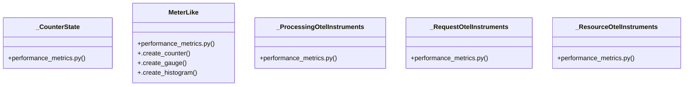

# Community 70

> 24 nodes · cohesion 0.10

## Key Concepts

- [_create_request_otel_instruments()](file:///C:/Users/1/github-pr/agent-meow/agent_meow/server/performance_metrics.py#L759) (7 connections)
- [MeterLike](file:///C:/Users/1/github-pr/agent-meow/agent_meow/server/performance_metrics.py#L133) (6 connections)
- [.__init__()](file:///C:/Users/1/github-pr/agent-meow/agent_meow/server/performance_metrics.py#L907) (6 connections)
- [_create_processing_otel_instruments()](file:///C:/Users/1/github-pr/agent-meow/agent_meow/server/performance_metrics.py#L815) (5 connections)
- [_create_resource_otel_instruments()](file:///C:/Users/1/github-pr/agent-meow/agent_meow/server/performance_metrics.py#L857) (5 connections)
- [.create_gauge()](file:///C:/Users/1/github-pr/agent-meow/agent_meow/server/performance_metrics.py#L155) (5 connections)
- [_CounterState](file:///C:/Users/1/github-pr/agent-meow/agent_meow/server/performance_metrics.py#L276) (3 connections)
- [.create_counter()](file:///C:/Users/1/github-pr/agent-meow/agent_meow/server/performance_metrics.py#L138) (3 connections)
- [.create_histogram()](file:///C:/Users/1/github-pr/agent-meow/agent_meow/server/performance_metrics.py#L172) (3 connections)
- [_ProcessingOtelInstruments](file:///C:/Users/1/github-pr/agent-meow/agent_meow/server/performance_metrics.py#L321) (3 connections)
- [_RequestOtelInstruments](file:///C:/Users/1/github-pr/agent-meow/agent_meow/server/performance_metrics.py#L291) (3 connections)
- [_ResourceOtelInstruments](file:///C:/Users/1/github-pr/agent-meow/agent_meow/server/performance_metrics.py#L345) (3 connections)
- [Protocol for the OpenTelemetry meter methods used by this module.](file:///C:/Users/1/github-pr/agent-meow/agent_meow/server/performance_metrics.py#L134) (1 connections)
- [Create a monotonic counter instrument.          :param name: Metric name, e.g.](file:///C:/Users/1/github-pr/agent-meow/agent_meow/server/performance_metrics.py#L144) (1 connections)
- [Create a synchronous gauge instrument.          :param name: Metric name, e.g.](file:///C:/Users/1/github-pr/agent-meow/agent_meow/server/performance_metrics.py#L161) (1 connections)
- [Create a histogram instrument.          :param name: Metric name, e.g.](file:///C:/Users/1/github-pr/agent-meow/agent_meow/server/performance_metrics.py#L178) (1 connections)
- [Last emitted cumulative counter values for OTEL delta publishing.      :param](file:///C:/Users/1/github-pr/agent-meow/agent_meow/server/performance_metrics.py#L277) (1 connections)
- [OpenTelemetry instruments for HTTP and WebSocket request state.      :param st](file:///C:/Users/1/github-pr/agent-meow/agent_meow/server/performance_metrics.py#L292) (1 connections)
- [OpenTelemetry gauges for HTTP request processing durations.      :param avg_ms](file:///C:/Users/1/github-pr/agent-meow/agent_meow/server/performance_metrics.py#L322) (1 connections)
- [OpenTelemetry gauges for process and system resource state.      :param cpu_pe](file:///C:/Users/1/github-pr/agent-meow/agent_meow/server/performance_metrics.py#L346) (1 connections)
- [Create OpenTelemetry instruments for request and WebSocket state.      :param](file:///C:/Users/1/github-pr/agent-meow/agent_meow/server/performance_metrics.py#L760) (1 connections)
- [Create OpenTelemetry instruments for request processing durations.      :param](file:///C:/Users/1/github-pr/agent-meow/agent_meow/server/performance_metrics.py#L818) (1 connections)
- [Create OpenTelemetry instruments for process and system resources.      :param](file:///C:/Users/1/github-pr/agent-meow/agent_meow/server/performance_metrics.py#L858) (1 connections)
- [Initialize OpenTelemetry instruments.          :param meter: Optional meter us](file:///C:/Users/1/github-pr/agent-meow/agent_meow/server/performance_metrics.py#L908) (1 connections)

## Class Diagram

## Relationships

- No strong cross-community connections detected

## Source Files

- [C:\Users\1\github-pr\agent-meow\agent_meow\server\performance_metrics.py](file:///C:/Users/1/github-pr/agent-meow/agent_meow/server/performance_metrics.py)

## Audit Trail

- EXTRACTED: 64 (100%)
- INFERRED: 0 (0%)
- AMBIGUOUS: 0 (0%)

---

*Part of the graphify knowledge wiki. See [[index]] to navigate.*