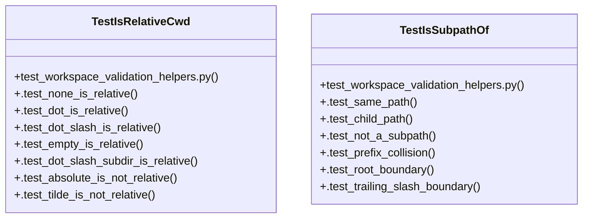

# Community 78

> 22 nodes · cohesion 0.14

## Key Concepts

- [_is_relative_cwd()](file:///C:/Users/1/github-pr/agent-meow/agent_meow/server/routes/_workspace_validation.py#L131) (11 connections)
- [_is_subpath_of()](file:///C:/Users/1/github-pr/agent-meow/agent_meow/server/routes/_workspace_validation.py#L152) (10 connections)
- [TestIsRelativeCwd](file:///C:/Users/1/github-pr/agent-meow/tests/server/routes/test_workspace_validation_helpers.py#L15) (9 connections)
- [TestIsSubpathOf](file:///C:/Users/1/github-pr/agent-meow/tests/server/routes/test_workspace_validation_helpers.py#L40) (8 connections)
- [test_workspace_validation_helpers.py](file:///C:/Users/1/github-pr/agent-meow/tests/server/routes/test_workspace_validation_helpers.py#L1) (3 connections)
- [.test_prefix_collision()](file:///C:/Users/1/github-pr/agent-meow/tests/server/routes/test_workspace_validation_helpers.py#L52) (3 connections)
- [.test_absolute_is_not_relative()](file:///C:/Users/1/github-pr/agent-meow/tests/server/routes/test_workspace_validation_helpers.py#L33) (2 connections)
- [.test_dot_is_relative()](file:///C:/Users/1/github-pr/agent-meow/tests/server/routes/test_workspace_validation_helpers.py#L21) (2 connections)
- [.test_dot_slash_is_relative()](file:///C:/Users/1/github-pr/agent-meow/tests/server/routes/test_workspace_validation_helpers.py#L24) (2 connections)
- [.test_dot_slash_subdir_is_relative()](file:///C:/Users/1/github-pr/agent-meow/tests/server/routes/test_workspace_validation_helpers.py#L30) (2 connections)
- [.test_empty_is_relative()](file:///C:/Users/1/github-pr/agent-meow/tests/server/routes/test_workspace_validation_helpers.py#L27) (2 connections)
- [.test_none_is_relative()](file:///C:/Users/1/github-pr/agent-meow/tests/server/routes/test_workspace_validation_helpers.py#L18) (2 connections)
- [.test_tilde_is_not_relative()](file:///C:/Users/1/github-pr/agent-meow/tests/server/routes/test_workspace_validation_helpers.py#L36) (2 connections)
- [.test_child_path()](file:///C:/Users/1/github-pr/agent-meow/tests/server/routes/test_workspace_validation_helpers.py#L46) (2 connections)
- [.test_not_a_subpath()](file:///C:/Users/1/github-pr/agent-meow/tests/server/routes/test_workspace_validation_helpers.py#L49) (2 connections)
- [.test_root_boundary()](file:///C:/Users/1/github-pr/agent-meow/tests/server/routes/test_workspace_validation_helpers.py#L56) (2 connections)
- [.test_same_path()](file:///C:/Users/1/github-pr/agent-meow/tests/server/routes/test_workspace_validation_helpers.py#L43) (2 connections)
- [.test_trailing_slash_boundary()](file:///C:/Users/1/github-pr/agent-meow/tests/server/routes/test_workspace_validation_helpers.py#L59) (2 connections)
- [Tests for workspace validation pure helpers.  The async ``validate_workspace``](file:///C:/Users/1/github-pr/agent-meow/tests/server/routes/test_workspace_validation_helpers.py#L1) (1 connections)
- [Tests for the spec cwd classification helper.](file:///C:/Users/1/github-pr/agent-meow/tests/server/routes/test_workspace_validation_helpers.py#L16) (1 connections)
- [Tests for the canonicalized path containment check.](file:///C:/Users/1/github-pr/agent-meow/tests/server/routes/test_workspace_validation_helpers.py#L41) (1 connections)
- [``/a/foo`` must NOT be treated as a subpath of ``/a/fo``.](file:///C:/Users/1/github-pr/agent-meow/tests/server/routes/test_workspace_validation_helpers.py#L53) (1 connections)

## Class Diagram

## Relationships

- [[Community 4]] (2 shared connections)

## Source Files

- [C:\Users\1\github-pr\agent-meow\agent_meow\server\routes\_workspace_validation.py](file:///C:/Users/1/github-pr/agent-meow/agent_meow/server/routes/_workspace_validation.py)
- [C:\Users\1\github-pr\agent-meow\tests\server\routes\test_workspace_validation_helpers.py](file:///C:/Users/1/github-pr/agent-meow/tests/server/routes/test_workspace_validation_helpers.py)

## Audit Trail

- EXTRACTED: 44 (61%)
- INFERRED: 28 (39%)
- AMBIGUOUS: 0 (0%)

---

*Part of the graphify knowledge wiki. See [[index]] to navigate.*