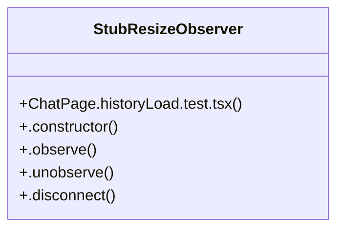

# Community 81

> 21 nodes · cohesion 0.10

## Key Concepts

- [ChatPage.historyLoad.test.tsx](file:///C:/Users/1/github-pr/agent-meow/web/src/pages/ChatPage.historyLoad.test.tsx#L1) (16 connections)
- [makeScroller()](file:///C:/Users/1/github-pr/agent-meow/web/src/pages/ChatPage.historyLoad.test.tsx#L177) (5 connections)
- [StubResizeObserver](file:///C:/Users/1/github-pr/agent-meow/web/src/pages/ChatPage.historyLoad.test.tsx#L127) (5 connections)
- [pill()](file:///C:/Users/1/github-pr/agent-meow/web/src/pages/ChatPage.historyLoad.test.tsx#L165) (2 connections)
- [setScrollMetrics()](file:///C:/Users/1/github-pr/agent-meow/web/src/pages/ChatPage.historyLoad.test.tsx#L24) (2 connections)
- [calls](file:///C:/Users/1/github-pr/agent-meow/web/src/pages/ChatPage.historyLoad.test.tsx#L283) (1 connections)
- [{ container }](file:///C:/Users/1/github-pr/agent-meow/web/src/pages/ChatPage.historyLoad.test.tsx#L57) (1 connections)
- [{ container, scroll, scroller }](file:///C:/Users/1/github-pr/agent-meow/web/src/pages/ChatPage.historyLoad.test.tsx#L232) (1 connections)
- [{ container, scroller }](file:///C:/Users/1/github-pr/agent-meow/web/src/pages/ChatPage.historyLoad.test.tsx#L192) (1 connections)
- [{ container, scroller, scroll }](file:///C:/Users/1/github-pr/agent-meow/web/src/pages/ChatPage.historyLoad.test.tsx#L276) (1 connections)
- [holder](file:///C:/Users/1/github-pr/agent-meow/web/src/pages/ChatPage.historyLoad.test.tsx#L126) (1 connections)
- [loadMoreHistory](file:///C:/Users/1/github-pr/agent-meow/web/src/pages/ChatPage.historyLoad.test.tsx#L65) (1 connections)
- [metrics](file:///C:/Users/1/github-pr/agent-meow/web/src/pages/ChatPage.historyLoad.test.tsx#L68) (1 connections)
- [originalLoadMoreHistory](file:///C:/Users/1/github-pr/agent-meow/web/src/pages/ChatPage.historyLoad.test.tsx#L14) (1 connections)
- [{ rerender }](file:///C:/Users/1/github-pr/agent-meow/web/src/pages/ChatPage.historyLoad.test.tsx#L72) (1 connections)
- [scrollRoot](file:///C:/Users/1/github-pr/agent-meow/web/src/pages/ChatPage.historyLoad.test.tsx#L67) (1 connections)
- [stickContext](file:///C:/Users/1/github-pr/agent-meow/web/src/pages/ChatPage.historyLoad.test.tsx#L6) (1 connections)
- [.constructor()](file:///C:/Users/1/github-pr/agent-meow/web/src/pages/ChatPage.historyLoad.test.tsx#L128) (1 connections)
- [.disconnect()](file:///C:/Users/1/github-pr/agent-meow/web/src/pages/ChatPage.historyLoad.test.tsx#L133) (1 connections)
- [.observe()](file:///C:/Users/1/github-pr/agent-meow/web/src/pages/ChatPage.historyLoad.test.tsx#L131) (1 connections)
- [.unobserve()](file:///C:/Users/1/github-pr/agent-meow/web/src/pages/ChatPage.historyLoad.test.tsx#L132) (1 connections)

## Class Diagram

## Relationships

- No strong cross-community connections detected

## Source Files

- [C:\Users\1\github-pr\agent-meow\web\src\pages\ChatPage.historyLoad.test.tsx](file:///C:/Users/1/github-pr/agent-meow/web/src/pages/ChatPage.historyLoad.test.tsx)

## Audit Trail

- EXTRACTED: 42 (91%)
- INFERRED: 4 (9%)
- AMBIGUOUS: 0 (0%)

---

*Part of the graphify knowledge wiki. See [[index]] to navigate.*