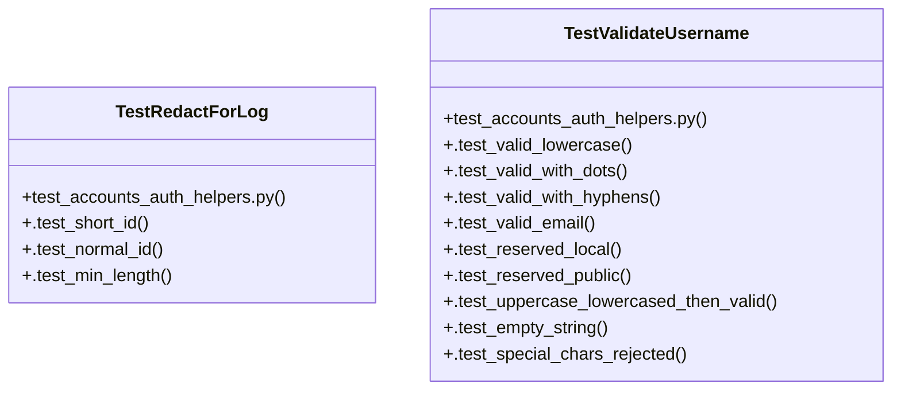

# Community 84

> 20 nodes · cohesion 0.15

## Key Concepts

- [_validate_username()](file:///C:/Users/1/github-pr/agent-meow/agent_meow/server/routes/accounts_auth.py#L172) (12 connections)
- [TestValidateUsername](file:///C:/Users/1/github-pr/agent-meow/tests/server/routes/test_accounts_auth_helpers.py#L15) (11 connections)
- [_redact_for_log()](file:///C:/Users/1/github-pr/agent-meow/agent_meow/server/routes/accounts_auth.py#L192) (6 connections)
- [TestRedactForLog](file:///C:/Users/1/github-pr/agent-meow/tests/server/routes/test_accounts_auth_helpers.py#L54) (5 connections)
- [test_accounts_auth_helpers.py](file:///C:/Users/1/github-pr/agent-meow/tests/server/routes/test_accounts_auth_helpers.py#L1) (3 connections)
- [.test_normal_id()](file:///C:/Users/1/github-pr/agent-meow/tests/server/routes/test_accounts_auth_helpers.py#L60) (3 connections)
- [.test_min_length()](file:///C:/Users/1/github-pr/agent-meow/tests/server/routes/test_accounts_auth_helpers.py#L66) (2 connections)
- [.test_short_id()](file:///C:/Users/1/github-pr/agent-meow/tests/server/routes/test_accounts_auth_helpers.py#L57) (2 connections)
- [.test_empty_string()](file:///C:/Users/1/github-pr/agent-meow/tests/server/routes/test_accounts_auth_helpers.py#L45) (2 connections)
- [.test_reserved_local()](file:///C:/Users/1/github-pr/agent-meow/tests/server/routes/test_accounts_auth_helpers.py#L30) (2 connections)
- [.test_reserved_public()](file:///C:/Users/1/github-pr/agent-meow/tests/server/routes/test_accounts_auth_helpers.py#L35) (2 connections)
- [.test_special_chars_rejected()](file:///C:/Users/1/github-pr/agent-meow/tests/server/routes/test_accounts_auth_helpers.py#L49) (2 connections)
- [.test_uppercase_lowercased_then_valid()](file:///C:/Users/1/github-pr/agent-meow/tests/server/routes/test_accounts_auth_helpers.py#L40) (2 connections)
- [.test_valid_email()](file:///C:/Users/1/github-pr/agent-meow/tests/server/routes/test_accounts_auth_helpers.py#L27) (2 connections)
- [.test_valid_lowercase()](file:///C:/Users/1/github-pr/agent-meow/tests/server/routes/test_accounts_auth_helpers.py#L18) (2 connections)
- [.test_valid_with_dots()](file:///C:/Users/1/github-pr/agent-meow/tests/server/routes/test_accounts_auth_helpers.py#L21) (2 connections)
- [.test_valid_with_hyphens()](file:///C:/Users/1/github-pr/agent-meow/tests/server/routes/test_accounts_auth_helpers.py#L24) (2 connections)
- [Tests for accounts auth route helper functions.  The full accounts auth flow r](file:///C:/Users/1/github-pr/agent-meow/tests/server/routes/test_accounts_auth_helpers.py#L1) (1 connections)
- [Tests for username format and reserved-name checks.](file:///C:/Users/1/github-pr/agent-meow/tests/server/routes/test_accounts_auth_helpers.py#L16) (1 connections)
- [Tests for log redaction of user IDs.](file:///C:/Users/1/github-pr/agent-meow/tests/server/routes/test_accounts_auth_helpers.py#L55) (1 connections)

## Class Diagram

## Relationships

- [[Community 4]] (2 shared connections)

## Source Files

- [C:\Users\1\github-pr\agent-meow\agent_meow\server\routes\accounts_auth.py](file:///C:/Users/1/github-pr/agent-meow/agent_meow/server/routes/accounts_auth.py)
- [C:\Users\1\github-pr\agent-meow\tests\server\routes\test_accounts_auth_helpers.py](file:///C:/Users/1/github-pr/agent-meow/tests/server/routes/test_accounts_auth_helpers.py)

## Audit Trail

- EXTRACTED: 38 (58%)
- INFERRED: 27 (42%)
- AMBIGUOUS: 0 (0%)

---

*Part of the graphify knowledge wiki. See [[index]] to navigate.*