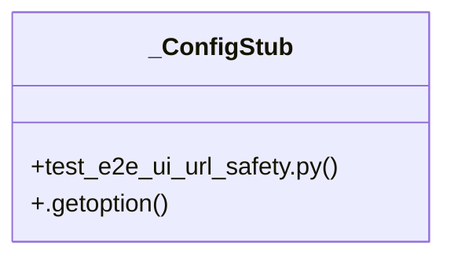

# Community 94

> 16 nodes · cohesion 0.22

## Key Concepts

- [unsafe_ui_base_url_reason()](file:///C:/Users/1/github-pr/agent-meow/tests/e2e_ui/url_safety.py#L14) (9 connections)
- [test_e2e_ui_url_safety.py](file:///C:/Users/1/github-pr/agent-meow/tests/test_e2e_ui_url_safety.py#L1) (8 connections)
- [url_safety.py](file:///C:/Users/1/github-pr/agent-meow/tests/e2e_ui/url_safety.py#L1) (5 connections)
- [_ConfigStub](file:///C:/Users/1/github-pr/agent-meow/tests/test_e2e_ui_url_safety.py#L15) (4 connections)
- [test_pytest_configure_rejects_dev_ui_base_url()](file:///C:/Users/1/github-pr/agent-meow/tests/test_e2e_ui_url_safety.py#L77) (4 connections)
- [test_pytest_configure_rejects_headed_in_ci()](file:///C:/Users/1/github-pr/agent-meow/tests/test_e2e_ui_url_safety.py#L70) (4 connections)
- [_dev_host_reason()](file:///C:/Users/1/github-pr/agent-meow/tests/e2e_ui/url_safety.py#L42) (4 connections)
- [_pytest_configure()](file:///C:/Users/1/github-pr/agent-meow/tests/test_e2e_ui_url_safety.py#L22) (3 connections)
- [_dev_address_reason()](file:///C:/Users/1/github-pr/agent-meow/tests/e2e_ui/url_safety.py#L67) (3 connections)
- [_resolved_dev_host_reason()](file:///C:/Users/1/github-pr/agent-meow/tests/e2e_ui/url_safety.py#L50) (3 connections)
- [test_unsafe_ui_base_url_reason_allows_public_non_dev_port()](file:///C:/Users/1/github-pr/agent-meow/tests/test_e2e_ui_url_safety.py#L56) (2 connections)
- [test_unsafe_ui_base_url_reason_handles_missing_port_explicitly()](file:///C:/Users/1/github-pr/agent-meow/tests/test_e2e_ui_url_safety.py#L64) (2 connections)
- [test_unsafe_ui_base_url_reason_refuses_dev_hosts()](file:///C:/Users/1/github-pr/agent-meow/tests/test_e2e_ui_url_safety.py#L46) (2 connections)
- [test_unsafe_ui_base_url_reason_refuses_known_dev_ports()](file:///C:/Users/1/github-pr/agent-meow/tests/test_e2e_ui_url_safety.py#L30) (2 connections)
- [Safety checks for opt-in e2e-ui external server reuse.](file:///C:/Users/1/github-pr/agent-meow/tests/e2e_ui/url_safety.py#L1) (1 connections)
- [Return why ``base_url`` looks unsafe for shared e2e-ui reuse.      ``--ui-base](file:///C:/Users/1/github-pr/agent-meow/tests/e2e_ui/url_safety.py#L15) (1 connections)

## Class Diagram

## Relationships

- No strong cross-community connections detected

## Source Files

- [C:\Users\1\github-pr\agent-meow\tests\e2e_ui\url_safety.py](file:///C:/Users/1/github-pr/agent-meow/tests/e2e_ui/url_safety.py)
- [C:\Users\1\github-pr\agent-meow\tests\test_e2e_ui_url_safety.py](file:///C:/Users/1/github-pr/agent-meow/tests/test_e2e_ui_url_safety.py)

## Audit Trail

- EXTRACTED: 45 (79%)
- INFERRED: 12 (21%)
- AMBIGUOUS: 0 (0%)

---

*Part of the graphify knowledge wiki. See [[index]] to navigate.*