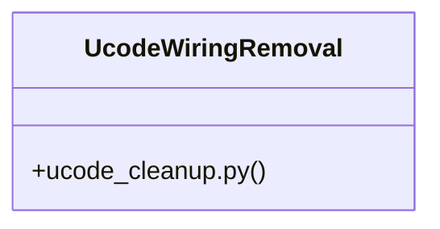

# Config Cleanup

> 39 nodes · cohesion 0.10

## Key Concepts

- [UcodeWiringRemoval](file:///C:/Users/1/github-pr/agent-meow/agent_meow/onboarding/ucode_cleanup.py#L90) (23 connections)
- [test_ucode_cleanup.py](file:///C:/Users/1/github-pr/agent-meow/tests/onboarding/test_ucode_cleanup.py#L1) (16 connections)
- [strip_ucode_codex_config()](file:///C:/Users/1/github-pr/agent-meow/agent_meow/onboarding/ucode_cleanup.py#L118) (16 connections)
- [remove_ucode_web_search_mcp()](file:///C:/Users/1/github-pr/agent-meow/agent_meow/onboarding/ucode_cleanup.py#L224) (12 connections)
- [ucode_cleanup.py](file:///C:/Users/1/github-pr/agent-meow/agent_meow/onboarding/ucode_cleanup.py#L1) (11 connections)
- [remove_ucode_wiring()](file:///C:/Users/1/github-pr/agent-meow/agent_meow/onboarding/ucode_cleanup.py#L268) (9 connections)
- [test_remove_ucode_wiring_composes_all_cleanups()](file:///C:/Users/1/github-pr/agent-meow/tests/onboarding/test_ucode_cleanup.py#L325) (6 connections)
- [test_remove_ucode_wiring_clean_machine_reports_no_change()](file:///C:/Users/1/github-pr/agent-meow/tests/onboarding/test_ucode_cleanup.py#L366) (5 connections)
- [test_remove_web_search_removes_ucode_owned_entry()](file:///C:/Users/1/github-pr/agent-meow/tests/onboarding/test_ucode_cleanup.py#L254) (4 connections)
- [test_strip_missing_file_returns_false()](file:///C:/Users/1/github-pr/agent-meow/tests/onboarding/test_ucode_cleanup.py#L142) (4 connections)
- [_default_claude_user_config_path()](file:///C:/Users/1/github-pr/agent-meow/agent_meow/onboarding/ucode_cleanup.py#L81) (4 connections)
- [_default_codex_config_path()](file:///C:/Users/1/github-pr/agent-meow/agent_meow/onboarding/ucode_cleanup.py#L56) (4 connections)
- [_remove_web_search_via_claude_cli()](file:///C:/Users/1/github-pr/agent-meow/agent_meow/onboarding/ucode_cleanup.py#L198) (4 connections)
- [Tests for :mod:`~?agent_meow.onboarding.ucode_cleanup`.  The fixture configs m](file:///C:/Users/1/github-pr/agent-meow/tests/onboarding/test_ucode_cleanup.py#L1) (3 connections)
- [A config ucode never touched is not rewritten at all.      Byte-identity (not](file:///C:/Users/1/github-pr/agent-meow/tests/onboarding/test_ucode_cleanup.py#L129) (3 connections)
- [A missing config is a no-op — and is not created as a side effect.](file:///C:/Users/1/github-pr/agent-meow/tests/onboarding/test_ucode_cleanup.py#L143) (3 connections)
- [A config that was *only* ucode's strips down to nothing.      Leftover empty `](file:///C:/Users/1/github-pr/agent-meow/tests/onboarding/test_ucode_cleanup.py#L150) (3 connections)
- [An unparseable config fails loud instead of being rewritten.      Rewriting a](file:///C:/Users/1/github-pr/agent-meow/tests/onboarding/test_ucode_cleanup.py#L177) (3 connections)
- [Build ucode's web_search MCP entry as ucode registers it (env marker).      :r](file:///C:/Users/1/github-pr/agent-meow/tests/onboarding/test_ucode_cleanup.py#L207) (3 connections)
- [Build a ucode web_search entry recognizable only by its binary name.      :ret](file:///C:/Users/1/github-pr/agent-meow/tests/onboarding/test_ucode_cleanup.py#L224) (3 connections)
- [Build a ``web_search`` entry the user registered themselves.      :returns: An](file:///C:/Users/1/github-pr/agent-meow/tests/onboarding/test_ucode_cleanup.py#L238) (3 connections)
- [A ucode-owned ``web_search`` entry is detected and removal delegated.      Bot](file:///C:/Users/1/github-pr/agent-meow/tests/onboarding/test_ucode_cleanup.py#L259) (3 connections)
- [The claude CLI is never invoked unless a ucode-owned entry is found.      Remo](file:///C:/Users/1/github-pr/agent-meow/tests/onboarding/test_ucode_cleanup.py#L298) (3 connections)
- [No ``~/.claude.json`` means nothing to do (fresh machine / no Claude).](file:///C:/Users/1/github-pr/agent-meow/tests/onboarding/test_ucode_cleanup.py#L321) (3 connections)
- [The orchestrator cleans a realistically-wired HOME end to end.      Sets up a](file:///C:/Users/1/github-pr/agent-meow/tests/onboarding/test_ucode_cleanup.py#L328) (3 connections)
- *... and 14 more nodes in this community*

## Class Diagram

## Relationships

- [[Community 3]] (8 shared connections)
- [[Auth Config]] (1 shared connections)

## Source Files

- [C:\Users\1\github-pr\agent-meow\agent_meow\onboarding\ucode_cleanup.py](file:///C:/Users/1/github-pr/agent-meow/agent_meow/onboarding/ucode_cleanup.py)
- [C:\Users\1\github-pr\agent-meow\tests\onboarding\test_ucode_cleanup.py](file:///C:/Users/1/github-pr/agent-meow/tests/onboarding/test_ucode_cleanup.py)

## Audit Trail

- EXTRACTED: 98 (51%)
- INFERRED: 93 (49%)
- AMBIGUOUS: 0 (0%)

---

*Part of the graphify knowledge wiki. See [[index]] to navigate.*