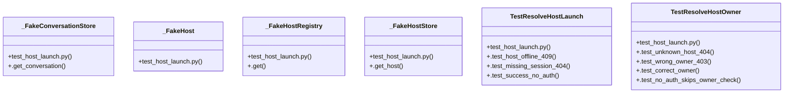

# Host Authorization

> 19 nodes · cohesion 0.26

## Key Concepts

- [resolve_host_launch()](file:///C:/Users/1/github-pr/agent-meow/agent_meow/server/routes/_host_launch.py#L82) (11 connections)
- [_FakeHostStore](file:///C:/Users/1/github-pr/agent-meow/tests/server/routes/test_host_launch.py#L29) (9 connections)
- [resolve_host_owner()](file:///C:/Users/1/github-pr/agent-meow/agent_meow/server/routes/_host_launch.py#L49) (8 connections)
- [.test_success_no_auth()](file:///C:/Users/1/github-pr/agent-meow/tests/server/routes/test_host_launch.py#L121) (8 connections)
- [test_host_launch.py](file:///C:/Users/1/github-pr/agent-meow/tests/server/routes/test_host_launch.py#L1) (7 connections)
- [_FakeHost](file:///C:/Users/1/github-pr/agent-meow/tests/server/routes/test_host_launch.py#L22) (7 connections)
- [.test_missing_session_404()](file:///C:/Users/1/github-pr/agent-meow/tests/server/routes/test_host_launch.py#L103) (7 connections)
- [.test_host_offline_409()](file:///C:/Users/1/github-pr/agent-meow/tests/server/routes/test_host_launch.py#L86) (6 connections)
- [_FakeConversationStore](file:///C:/Users/1/github-pr/agent-meow/tests/server/routes/test_host_launch.py#L45) (5 connections)
- [_FakeHostRegistry](file:///C:/Users/1/github-pr/agent-meow/tests/server/routes/test_host_launch.py#L37) (5 connections)
- [TestResolveHostOwner](file:///C:/Users/1/github-pr/agent-meow/tests/server/routes/test_host_launch.py#L55) (5 connections)
- [TestResolveHostLaunch](file:///C:/Users/1/github-pr/agent-meow/tests/server/routes/test_host_launch.py#L85) (4 connections)
- [.test_correct_owner()](file:///C:/Users/1/github-pr/agent-meow/tests/server/routes/test_host_launch.py#L69) (4 connections)
- [.test_no_auth_skips_owner_check()](file:///C:/Users/1/github-pr/agent-meow/tests/server/routes/test_host_launch.py#L75) (4 connections)
- [.test_wrong_owner_403()](file:///C:/Users/1/github-pr/agent-meow/tests/server/routes/test_host_launch.py#L62) (4 connections)
- [.get()](file:///C:/Users/1/github-pr/agent-meow/tests/server/routes/test_host_launch.py#L40) (3 connections)
- [.test_unknown_host_404()](file:///C:/Users/1/github-pr/agent-meow/tests/server/routes/test_host_launch.py#L56) (3 connections)
- [.get_conversation()](file:///C:/Users/1/github-pr/agent-meow/tests/server/routes/test_host_launch.py#L48) (2 connections)
- [Tests for the host launch authorization helpers.  Tests ``resolve_host_owner``](file:///C:/Users/1/github-pr/agent-meow/tests/server/routes/test_host_launch.py#L1) (1 connections)

## Class Diagram

## Relationships

- [[Community 4]] (2 shared connections)

## Source Files

- [C:\Users\1\github-pr\agent-meow\agent_meow\server\routes\_host_launch.py](file:///C:/Users/1/github-pr/agent-meow/agent_meow/server/routes/_host_launch.py)
- [C:\Users\1\github-pr\agent-meow\tests\server\routes\test_host_launch.py](file:///C:/Users/1/github-pr/agent-meow/tests/server/routes/test_host_launch.py)

## Audit Trail

- EXTRACTED: 81 (79%)
- INFERRED: 22 (21%)
- AMBIGUOUS: 0 (0%)

---

*Part of the graphify knowledge wiki. See [[index]] to navigate.*