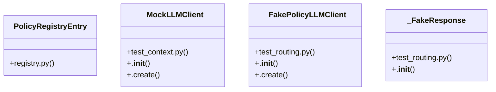

# Policy Orchestration

> 561 nodes · cohesion 0.01

## Key Concepts

- [policy()](file:///C:/Users/1/github-pr/agent-meow/web/src/pages/PoliciesPage.test.tsx#L36) (244 connections)
- [Tc()](file:///C:/Users/1/github-pr/agent-meow/agent_meow/server/static/web-ui/assets/react-dom-CR3QcCjK.js#L8) (94 connections)
- [test_google.py](file:///C:/Users/1/github-pr/agent-meow/tests/policies/builtins/test_google.py#L1) (56 connections)
- [test_github.py](file:///C:/Users/1/github-pr/agent-meow/tests/policies/builtins/test_github.py#L1) (49 connections)
- [github_policy()](file:///C:/Users/1/github-pr/agent-meow/agent_meow/policies/builtins/github.py#L863) (46 connections)
- [load_registry()](file:///C:/Users/1/github-pr/agent-meow/agent_meow/policies/registry.py#L68) (42 connections)
- [test_cost.py](file:///C:/Users/1/github-pr/agent-meow/tests/policies/builtins/test_cost.py#L1) (41 connections)
- [test_routing.py](file:///C:/Users/1/github-pr/agent-meow/tests/policies/builtins/test_routing.py#L1) (40 connections)
- [test_safety.py](file:///C:/Users/1/github-pr/agent-meow/tests/policies/builtins/test_safety.py#L1) (36 connections)
- [test_working_dir.py](file:///C:/Users/1/github-pr/agent-meow/tests/policies/builtins/test_working_dir.py#L1) (36 connections)
- [gdrive_policy()](file:///C:/Users/1/github-pr/agent-meow/agent_meow/policies/builtins/google.py#L719) (36 connections)
- [cost_budget()](file:///C:/Users/1/github-pr/agent-meow/agent_meow/policies/builtins/cost.py#L416) (34 connections)
- [block_working_dir_changes()](file:///C:/Users/1/github-pr/agent-meow/agent_meow/policies/builtins/working_dir.py#L251) (33 connections)
- [_sh()](file:///C:/Users/1/github-pr/agent-meow/tests/policies/builtins/test_github.py#L42) (27 connections)
- [_sh()](file:///C:/Users/1/github-pr/agent-meow/tests/policies/builtins/test_working_dir.py#L40) (27 connections)
- [test_risk_score.py](file:///C:/Users/1/github-pr/agent-meow/tests/policies/builtins/test_risk_score.py#L1) (26 connections)
- [block_skills()](file:///C:/Users/1/github-pr/agent-meow/agent_meow/policies/builtins/safety.py#L232) (26 connections)
- [risk_score_policy()](file:///C:/Users/1/github-pr/agent-meow/agent_meow/policies/builtins/risk_score.py#L330) (23 connections)
- [deny_pii_in_llm_request()](file:///C:/Users/1/github-pr/agent-meow/agent_meow/policies/builtins/safety.py#L457) (22 connections)
- [_FakePolicyLLMClient](file:///C:/Users/1/github-pr/agent-meow/tests/policies/builtins/test_routing.py#L78) (22 connections)
- [validate_factory_params()](file:///C:/Users/1/github-pr/agent-meow/agent_meow/policies/registry.py#L208) (21 connections)
- [test_safety_pii.py](file:///C:/Users/1/github-pr/agent-meow/tests/policies/builtins/test_safety_pii.py#L1) (20 connections)
- [_tool()](file:///C:/Users/1/github-pr/agent-meow/tests/policies/builtins/test_cost.py#L45) (20 connections)
- [test_user_daily_cost.py](file:///C:/Users/1/github-pr/agent-meow/tests/policies/builtins/test_user_daily_cost.py#L1) (18 connections)
- [test_registry.py](file:///C:/Users/1/github-pr/agent-meow/tests/policies/test_registry.py#L1) (18 connections)
- *... and 536 more nodes in this community*

## Class Diagram

## Relationships

- [[Community 4]] (206 shared connections)
- [[Community 18]] (3 shared connections)
- [[Community 3]] (2 shared connections)
- [[Community 16]] (1 shared connections)
- [[Community 6]] (1 shared connections)
- [[Community 19]] (1 shared connections)

## Source Files

- [C:\Users\1\github-pr\agent-meow\agent_meow\policies\builtins\context.py](file:///C:/Users/1/github-pr/agent-meow/agent_meow/policies/builtins/context.py)
- [C:\Users\1\github-pr\agent-meow\agent_meow\policies\builtins\cost.py](file:///C:/Users/1/github-pr/agent-meow/agent_meow/policies/builtins/cost.py)
- [C:\Users\1\github-pr\agent-meow\agent_meow\policies\builtins\github.py](file:///C:/Users/1/github-pr/agent-meow/agent_meow/policies/builtins/github.py)
- [C:\Users\1\github-pr\agent-meow\agent_meow\policies\builtins\google.py](file:///C:/Users/1/github-pr/agent-meow/agent_meow/policies/builtins/google.py)
- [C:\Users\1\github-pr\agent-meow\agent_meow\policies\builtins\prompt.py](file:///C:/Users/1/github-pr/agent-meow/agent_meow/policies/builtins/prompt.py)
- [C:\Users\1\github-pr\agent-meow\agent_meow\policies\builtins\risk_score.py](file:///C:/Users/1/github-pr/agent-meow/agent_meow/policies/builtins/risk_score.py)
- [C:\Users\1\github-pr\agent-meow\agent_meow\policies\builtins\routing.py](file:///C:/Users/1/github-pr/agent-meow/agent_meow/policies/builtins/routing.py)
- [C:\Users\1\github-pr\agent-meow\agent_meow\policies\builtins\safety.py](file:///C:/Users/1/github-pr/agent-meow/agent_meow/policies/builtins/safety.py)
- [C:\Users\1\github-pr\agent-meow\agent_meow\policies\builtins\working_dir.py](file:///C:/Users/1/github-pr/agent-meow/agent_meow/policies/builtins/working_dir.py)
- [C:\Users\1\github-pr\agent-meow\agent_meow\policies\registry.py](file:///C:/Users/1/github-pr/agent-meow/agent_meow/policies/registry.py)
- [C:\Users\1\github-pr\agent-meow\agent_meow\server\static\web-ui\assets\react-dom-CR3QcCjK.js](file:///C:/Users/1/github-pr/agent-meow/agent_meow/server/static/web-ui/assets/react-dom-CR3QcCjK.js)
- [C:\Users\1\github-pr\agent-meow\tests\entities\test_policy.py](file:///C:/Users/1/github-pr/agent-meow/tests/entities/test_policy.py)
- [C:\Users\1\github-pr\agent-meow\tests\policies\builtins\helpers.py](file:///C:/Users/1/github-pr/agent-meow/tests/policies/builtins/helpers.py)
- [C:\Users\1\github-pr\agent-meow\tests\policies\builtins\test_context.py](file:///C:/Users/1/github-pr/agent-meow/tests/policies/builtins/test_context.py)
- [C:\Users\1\github-pr\agent-meow\tests\policies\builtins\test_cost.py](file:///C:/Users/1/github-pr/agent-meow/tests/policies/builtins/test_cost.py)
- [C:\Users\1\github-pr\agent-meow\tests\policies\builtins\test_enforce_sandbox.py](file:///C:/Users/1/github-pr/agent-meow/tests/policies/builtins/test_enforce_sandbox.py)
- [C:\Users\1\github-pr\agent-meow\tests\policies\builtins\test_github.py](file:///C:/Users/1/github-pr/agent-meow/tests/policies/builtins/test_github.py)
- [C:\Users\1\github-pr\agent-meow\tests\policies\builtins\test_google.py](file:///C:/Users/1/github-pr/agent-meow/tests/policies/builtins/test_google.py)
- [C:\Users\1\github-pr\agent-meow\tests\policies\builtins\test_risk_score.py](file:///C:/Users/1/github-pr/agent-meow/tests/policies/builtins/test_risk_score.py)
- [C:\Users\1\github-pr\agent-meow\tests\policies\builtins\test_routing.py](file:///C:/Users/1/github-pr/agent-meow/tests/policies/builtins/test_routing.py)

## Audit Trail

- EXTRACTED: 1716 (53%)
- INFERRED: 1518 (47%)
- AMBIGUOUS: 0 (0%)

---

*Part of the graphify knowledge wiki. See [[index]] to navigate.*