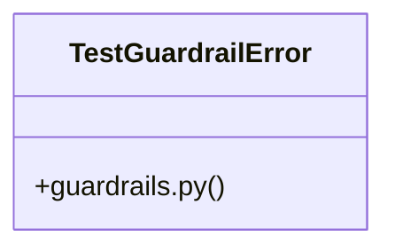

# Test Environment Checks

> 49 nodes · cohesion 0.07

## Key Concepts

- [check_test_environment()](file:///C:/Users/1/github-pr/agent-meow/agent_meow/testing/guardrails.py#L220) (25 connections)
- [test_guardrails.py](file:///C:/Users/1/github-pr/agent-meow/tests/testing/test_guardrails.py#L1) (20 connections)
- [guardrails.py](file:///C:/Users/1/github-pr/agent-meow/agent_meow/testing/guardrails.py#L1) (13 connections)
- [looks_like_test_db()](file:///C:/Users/1/github-pr/agent-meow/agent_meow/testing/guardrails.py#L104) (9 connections)
- [TestGuardrailError](file:///C:/Users/1/github-pr/agent-meow/agent_meow/testing/guardrails.py#L62) (9 connections)
- [_guardrail_warnings()](file:///C:/Users/1/github-pr/agent-meow/tests/testing/test_guardrails.py#L30) (8 connections)
- [looks_like_pytest()](file:///C:/Users/1/github-pr/agent-meow/agent_meow/testing/guardrails.py#L73) (7 connections)
- [base_url_violation()](file:///C:/Users/1/github-pr/agent-meow/agent_meow/testing/guardrails.py#L192) (6 connections)
- [_resolve()](file:///C:/Users/1/github-pr/agent-meow/agent_meow/testing/guardrails.py#L184) (6 connections)
- [_guardrails_disabled()](file:///C:/Users/1/github-pr/agent-meow/agent_meow/testing/guardrails.py#L297) (5 connections)
- [_has_test_token()](file:///C:/Users/1/github-pr/agent-meow/agent_meow/testing/guardrails.py#L160) (5 connections)
- [_under_temp_dir()](file:///C:/Users/1/github-pr/agent-meow/agent_meow/testing/guardrails.py#L165) (5 connections)
- [_sqlite_path_has_test_token()](file:///C:/Users/1/github-pr/agent-meow/agent_meow/testing/guardrails.py#L155) (4 connections)
- [test_clean_environment_emits_no_warning()](file:///C:/Users/1/github-pr/agent-meow/tests/testing/test_guardrails.py#L42) (4 connections)
- [test_dev_port_base_url_warns()](file:///C:/Users/1/github-pr/agent-meow/tests/testing/test_guardrails.py#L145) (4 connections)
- [test_multiple_violations_each_warn()](file:///C:/Users/1/github-pr/agent-meow/tests/testing/test_guardrails.py#L168) (4 connections)
- [test_non_test_process_warns()](file:///C:/Users/1/github-pr/agent-meow/tests/testing/test_guardrails.py#L109) (4 connections)
- [test_warn_only_never_raises()](file:///C:/Users/1/github-pr/agent-meow/tests/testing/test_guardrails.py#L184) (4 connections)
- [_imported_modules()](file:///C:/Users/1/github-pr/agent-meow/agent_meow/testing/guardrails.py#L93) (3 connections)
- [test_dev_port_base_url_hard_fails()](file:///C:/Users/1/github-pr/agent-meow/tests/testing/test_guardrails.py#L255) (3 connections)
- [test_escape_hatch_downgrades_hard_fail_to_warning()](file:///C:/Users/1/github-pr/agent-meow/tests/testing/test_guardrails.py#L226) (3 connections)
- [test_hard_fail_raises_on_violation()](file:///C:/Users/1/github-pr/agent-meow/tests/testing/test_guardrails.py#L203) (3 connections)
- [test_hard_fail_rejects_non_sqlite_test_substrings()](file:///C:/Users/1/github-pr/agent-meow/tests/testing/test_guardrails.py#L220) (3 connections)
- [test_real_db_warns()](file:///C:/Users/1/github-pr/agent-meow/tests/testing/test_guardrails.py#L133) (3 connections)
- [Unit tests for the test-environment guardrails.  In-process only: no server, n](file:///C:/Users/1/github-pr/agent-meow/tests/testing/test_guardrails.py#L1) (2 connections)
- *... and 24 more nodes in this community*

## Class Diagram

## Relationships

- No strong cross-community connections detected

## Source Files

- [C:\Users\1\github-pr\agent-meow\agent_meow\testing\guardrails.py](file:///C:/Users/1/github-pr/agent-meow/agent_meow/testing/guardrails.py)
- [C:\Users\1\github-pr\agent-meow\tests\testing\test_guardrails.py](file:///C:/Users/1/github-pr/agent-meow/tests/testing/test_guardrails.py)

## Audit Trail

- EXTRACTED: 129 (65%)
- INFERRED: 69 (35%)
- AMBIGUOUS: 0 (0%)

---

*Part of the graphify knowledge wiki. See [[index]] to navigate.*