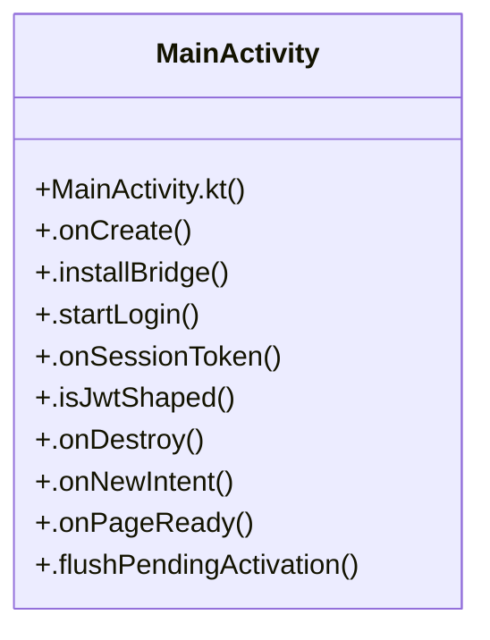

# User Interface

> 20 nodes · cohesion 0.10

## Key Concepts

- [MainActivity](file:///C:/Users/1/github-pr/agent-meow/web/android/app/src/main/java/io/cubecloud/agentmeow/MainActivity.kt#L39) (19 connections)
- [.onCreate()](file:///C:/Users/1/github-pr/agent-meow/web/android/app/src/main/java/io/cubecloud/agentmeow/MainActivity.kt#L86) (2 connections)
- [MainActivity.kt](file:///C:/Users/1/github-pr/agent-meow/web/android/app/src/main/java/io/cubecloud/agentmeow/MainActivity.kt#L1) (1 connections)
- [.chooseFiles()](file:///C:/Users/1/github-pr/agent-meow/web/android/app/src/main/java/io/cubecloud/agentmeow/MainActivity.kt#L460) (1 connections)
- [.downloadFile()](file:///C:/Users/1/github-pr/agent-meow/web/android/app/src/main/java/io/cubecloud/agentmeow/MainActivity.kt#L504) (1 connections)
- [.emitInsets()](file:///C:/Users/1/github-pr/agent-meow/web/android/app/src/main/java/io/cubecloud/agentmeow/MainActivity.kt#L413) (1 connections)
- [.emitNotificationActivation()](file:///C:/Users/1/github-pr/agent-meow/web/android/app/src/main/java/io/cubecloud/agentmeow/MainActivity.kt#L404) (1 connections)
- [.ensureNotificationPermission()](file:///C:/Users/1/github-pr/agent-meow/web/android/app/src/main/java/io/cubecloud/agentmeow/MainActivity.kt#L452) (1 connections)
- [.flushPendingActivation()](file:///C:/Users/1/github-pr/agent-meow/web/android/app/src/main/java/io/cubecloud/agentmeow/MainActivity.kt#L390) (1 connections)
- [.handlePermissionRequest()](file:///C:/Users/1/github-pr/agent-meow/web/android/app/src/main/java/io/cubecloud/agentmeow/MainActivity.kt#L489) (1 connections)
- [.hasPermission()](file:///C:/Users/1/github-pr/agent-meow/web/android/app/src/main/java/io/cubecloud/agentmeow/MainActivity.kt#L449) (1 connections)
- [.installBridge()](file:///C:/Users/1/github-pr/agent-meow/web/android/app/src/main/java/io/cubecloud/agentmeow/MainActivity.kt#L225) (1 connections)
- [.isJwtShaped()](file:///C:/Users/1/github-pr/agent-meow/web/android/app/src/main/java/io/cubecloud/agentmeow/MainActivity.kt#L337) (1 connections)
- [.mimeTypeFor()](file:///C:/Users/1/github-pr/agent-meow/web/android/app/src/main/java/io/cubecloud/agentmeow/MainActivity.kt#L477) (1 connections)
- [.navigatePathOf()](file:///C:/Users/1/github-pr/agent-meow/web/android/app/src/main/java/io/cubecloud/agentmeow/MainActivity.kt#L400) (1 connections)
- [.onDestroy()](file:///C:/Users/1/github-pr/agent-meow/web/android/app/src/main/java/io/cubecloud/agentmeow/MainActivity.kt#L348) (1 connections)
- [.onNewIntent()](file:///C:/Users/1/github-pr/agent-meow/web/android/app/src/main/java/io/cubecloud/agentmeow/MainActivity.kt#L360) (1 connections)
- [.onPageReady()](file:///C:/Users/1/github-pr/agent-meow/web/android/app/src/main/java/io/cubecloud/agentmeow/MainActivity.kt#L370) (1 connections)
- [.onSessionToken()](file:///C:/Users/1/github-pr/agent-meow/web/android/app/src/main/java/io/cubecloud/agentmeow/MainActivity.kt#L284) (1 connections)
- [.startLogin()](file:///C:/Users/1/github-pr/agent-meow/web/android/app/src/main/java/io/cubecloud/agentmeow/MainActivity.kt#L252) (1 connections)

## Class Diagram

## Relationships

- No strong cross-community connections detected

## Source Files

- [C:\Users\1\github-pr\agent-meow\web\android\app\src\main\java\io\cubecloud\agentmeow\MainActivity.kt](file:///C:/Users/1/github-pr/agent-meow/web/android/app/src/main/java/io/cubecloud/agentmeow/MainActivity.kt)

## Audit Trail

- EXTRACTED: 38 (97%)
- INFERRED: 1 (3%)
- AMBIGUOUS: 0 (0%)

---

*Part of the graphify knowledge wiki. See [[index]] to navigate.*