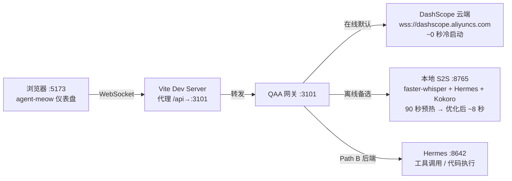

# 计划 006b：在线/离线混合语音部署接线

> **执行者须知**：本计划补充 006（安装 QAA + DashScope）和 007（移植实时
> 语音钩子）之间的部署细节——回答"在线 DashScope 方案如何部署到
> agent-meow 仪表盘，以及在线/离线如何切换"。

## 状态

- **优先级**：P1
- **工作量**：S
- **风险**：LOW
- **依赖**：006（QAA 网关已安装、DashScope API 密钥已配置）
- **被依赖**：007（移植实时语音钩子时需要了解此接线方案）
- **编写于**：提交 `62d34897`，2026-08-04

## 问题

006 安装了 QAA 网关并配置了 DashScope，但只验证了 QAA 自带的 Web UI。
它没有解释：

1. agent-meow 的浏览器（`:5173`）如何连接到 QAA 网关（`:3101`）
2. 在线（DashScope 云端）和离线（本地 S2S）如何同时配置
3. 用户在仪表盘上如何切换在线/离线模式
4. Vite 开发服务器的代理如何转发到 QAA 网关

## 混合架构总览



## 两种部署模式

### 在线模式（DashScope 云端，默认）

```
浏览器 → Vite (:5173) → QAA 网关 (:3101) → DashScope 云端
```

- **零预热**：DashScope 是常驻云端服务，~0 秒冷启动
- **端到端 S2S**：STT + LLM + TTS 在一个 WebSocket 内完成
- **中文原生支持**：`qwen-audio-3.0-realtime-flash` 模型
- **成本**：90 天免费（100 万 token ≈ 11 小时音频），之后 ~¥0.20/分钟
- **配置**：`QWEN_AUDIO_REALTIME_PROVIDER=dashscope`

### 离线模式（本地 S2S，备选）

```
浏览器 → Vite (:5173) → QAA 网关 (:3101) → 本地 S2S (:8765)
                                                    ├─ STT: faster-whisper (CPU 90s / GPU 优化后 ~8s)
                                                    ├─ LLM: Hermes (:8642)
                                                    └─ TTS: Kokoro-82M (CPU)
```

- **完全本地**：无需互联网，零成本
- **预热**：90 秒（Plan 008 优化后 ~8 秒或 ~0 秒热池）
- **配置**：`QWEN_AUDIO_REALTIME_PROVIDER=speech-to-speech`

## 部署步骤

### 第 1 步：配置 QAA 同时启用两个提供商

QAA 的 `config.env`（006 已创建）中确保两个提供商都已配置：

```dotenv
# === 在线（云端，默认）===
DASHSCOPE_API_KEY=<你的-sk-密钥>
QWEN_AUDIO_REALTIME_PROVIDER=dashscope
QWEN_AUDIO_REALTIME_MODEL=qwen-audio-3.0-realtime-flash
AGENT_PROTOCOL=none

# === 离线（本地 S2S，备选）===
SPEECH_TO_SPEECH_REALTIME_URL=ws://127.0.0.1:8765/v1/realtime
```

当两个提供商都通过 `isConfigured()` 检查时，QAA 网关会在健康检查中
广播两个提供商（`realtimeProviders` 数组包含 `dashscope` 和
`speech-to-speech`），浏览器端会出现切换下拉框。

**验证**：`curl http://127.0.0.1:3101/api/health` 返回的 JSON 中
`realtimeProviders` 包含两个提供商。

### 第 2 步：配置 Vite 代理转发到 QAA 网关

在 `web/vite.config.ts` 中添加 WebSocket 代理规则，将浏览器到
`/api/realtime` 的 WebSocket 连接转发到 QAA 网关 `:3101`：

```typescript
// vite.config.ts — 在 server.proxy 中添加:
'/api': {
  target: 'http://127.0.0.1:3101',
  changeOrigin: true,
  ws: true,  // 关键：启用 WebSocket 代理
},
```

这样 agent-meow 的浏览器页面（`:5173`）可以通过同源 WebSocket
（`ws://127.0.0.1:5173/api/realtime`）连接到 QAA 网关，避免跨域问题。

**验证**：浏览器开发者工具中 Network → WS 标签页显示到
`/api/realtime` 的 WebSocket 连接成功建立（101 Switching Protocols）。

### 第 3 步：启动顺序

```powershell
# 1. Hermes Docker（用户自行管理，已运行）
# 2. QAA 网关（006 已创建启动脚本）:
.\scripts\start-qaa-gateway.ps1
# 3. 本地 S2S（离线模式才需要，Plan 008 优化后启动）:
.\scripts\start-s2s-detached.ps1   # 可选，仅在需要离线模式时启动
# 4. Vite 开发服务器:
cd web; npm run dev
```

**注意**：离线 S2S 服务器不需要一直运行。它只在用户切换到离线模式时
才需要。如果 S2S 未运行，离线选项不会出现在切换器中（`isConfigured()`
检查 URL 是否设置，但如果连接失败会自动回退到在线模式）。

### 第 4 步：在线/离线切换（用户侧）

在 agent-meow 仪表盘的语音面板中（Plan 007 移植后），用户通过切换器
选择模式：

- **☁️ 在线**：`realtimeProvider = "dashscope"` → 连接 DashScope 云端
- **🏠 离线**：`realtimeProvider = "speech-to-speech"` → 连接本地 S2S

切换时 QAA 自动断开当前 WebSocket 并用新提供商重新连接。
选择持久化在 `localStorage`（`qwen-audio-agent.realtimeProvider`）。

**自动回退**：如果在线模式连接 DashScope 失败（网络中断、额度用尽），
`useVoiceMode` 钩子自动切换到离线模式。网络恢复后自动切回在线。

### 第 5 步：Path B 后端代理（可选，Plan 009）

如果需要语音驱动工具调用（代码执行、文件操作、MCP 工具），配置
`AGENT_PROTOCOL=acp` 并指向 agent-meow 的 ACP 端点：

```dotenv
AGENT_PROTOCOL=acp
QWEN_AUDIO_AGENT_BACKEND_URL=ws://127.0.0.1:<agent-meow端口>/acp/realtime
```

后端（Hermes）在在线和离线模式下都可用——因为 Hermes 是本地 Docker，
与实时语音提供商无关。

## 验收标准

- [ ] `curl http://127.0.0.1:3101/api/health` 返回两个提供商
- [ ] Vite 代理配置中 `/api` 转发到 `:3101` 且 `ws: true`
- [ ] 浏览器能通过 `:5173/api/realtime` 建立 WebSocket 连接到 QAA
- [ ] 在线模式：语音通过 DashScope 云端往返 <3 秒
- [ ] 离线模式：语音通过本地 S2S 往返（预热后）
- [ ] 切换在线/离线时 WebSocket 自动重连
- [ ] `plans/README.md` 状态行已更新

## 停止条件

- Vite 代理配置文件结构与预期不同——检查 `web/vite.config.ts` 中
  `server.proxy` 的现有配置格式，匹配后继续。
- QAA 网关健康检查未返回两个提供商——确认 `config.env` 中
  `SPEECH_TO_SPEECH_REALTIME_URL` 已设置且 QAA 重新启动。
- 浏览器 WebSocket 连接到 `/api/realtime` 失败（404 或 403）——
  确认 Vite 代理的 `ws: true` 选项已启用，且 QAA 网关正在运行。
