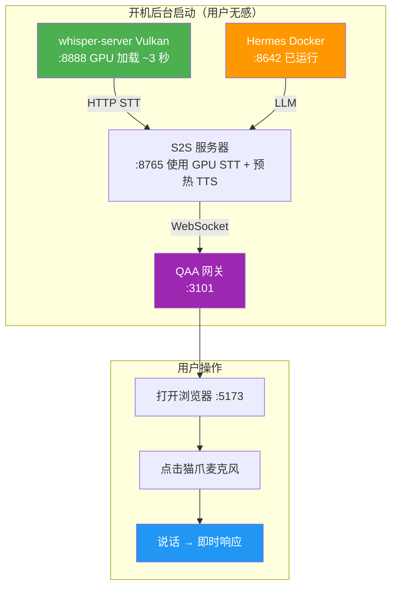

# 计划 008 概要：GPU 加速语音识别（离线预热优化）

## 问题

本地 S2S 语音服务器预热需要 **90 秒**。根因：faster-whisper 只支持 CUDA，
无法使用本机的 AMD GPU——**GPU 和 NPU 完全闲置**。

## 目标

用 whisper.cpp + Vulkan 将语音识别放到 GPU 上运行。
预热时间从 **90 秒 → ~8 秒**（配合预热机制可至 **~0 秒**）。

## 机器配置

- AMD Ryzen AI MAX+ 395（16 核 / 32 线程，32GB 内存）
- AMD Radeon 8060S 集成显卡（Vulkan 1.4.329 ✅）
- AMD XDNA 2 NPU（已识别 ✅）
- AMD ROCm 7.1（已安装 ✅）

## 范围

| 范围内                                                | 范围外                           |
| ----------------------------------------------------- | -------------------------------- |
| 克隆并构建 whisper.cpp（Vulkan）                      | 前端代码（`web/`）               |
| `scripts/start-whisper-server-vulkan.ps1`（新建）     | 后端代码（`agent_meow/server/`） |
| `scripts/start-speech-to-speech.ps1`（修改 STT 来源） | S2S Python 包源码                |

## 步骤概要

1. **构建** — `cmake -DGGML_VULKAN=1` 编译 whisper.cpp
2. **测速** — GPU vs CPU 基准对比（目标：编码器 <5 秒）
3. **启动** — `whisper-server` 监听 `:8888`，模型加载到 GPU 显存
4. **脚本** — 创建开机启动脚本
5. **接入** — 将 S2S 的 STT 切换到 whisper-server（3 个方案：远程端点 / Python 绑定 / 独立流）
6. **预热 TTS** — 开机时发送虚拟请求预热 Kokoro
7. **冒烟测试** — 离线语音往返 <10 秒

## 架构图

## 预期效果

| 指标       | 优化前        | 优化后                    |
| ---------- | ------------- | ------------------------- |
| STT 预热   | ~60 秒（CPU） | ~3 秒（GPU Vulkan）       |
| TTS 预热   | ~30 秒        | ~0 秒（开机预热）         |
| 总预热     | **~90 秒**    | **~8 秒**（或 ~0 秒热池） |
| GPU 利用率 | 0%（闲置）    | STT 在 GPU 运行           |
| 成本       | 免费          | 免费（本地，无云端）      |
