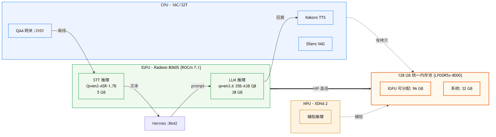
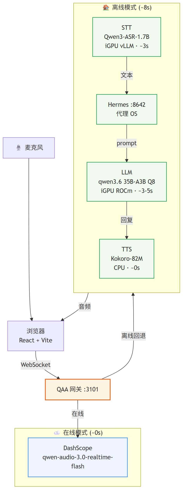
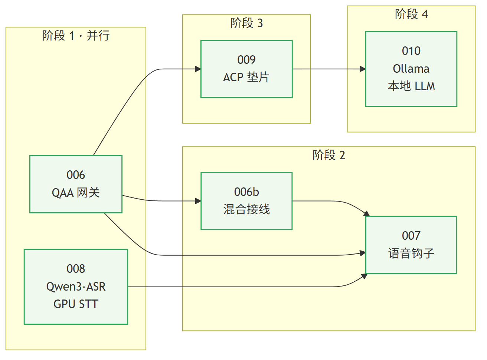
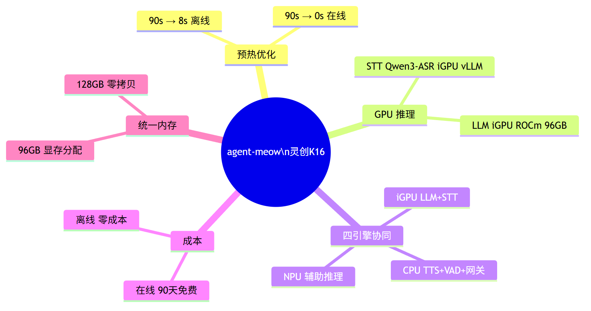

---
marp: true
theme: meowcat
paginate: true
size: 16:9
---

<!-- MeowCat theme source: plans/themes/meowcat.css -->

# agent-meow 双平台综合报告

## 灵创K16 (395) + 橘宝R16 (HX470)

**日期**：2026-08-05 · **状态**：灵创K16 已推送，橘宝R16 评估中

> 把 90 秒冷启动改造成 0 秒在线 / 离线 3-8 秒的本地语音代理

---

# 硬件对比

| 组件      | 灵创K16 (AI MAX+ 395)   | 橘宝R16 (HX 470+5060)           |
| --------- | ----------------------- | ------------------------------- |
| CPU       | 16C/32T Zen5            | 12C/24T Zen5 (Gorgon Point)     |
| iGPU      | Radeon 8060S (RDNA 3.5) | Radeon 890M (RDNA 3.5)          |
| iGPU 显存 | **96GB** (128GB 总内存) | **32GB** 统一内存               |
| dGPU      | 无                      | **RTX 5060 Laptop (8GB GDDR7)** |
| CUDA      | 无                      | **RTX 5060 原生支持**           |
| NPU       | XDNA 2 辅助推理         | XDNA 2 (~50 TOPS)               |
| 内存      | **128GB** LPDDR5x-8000  | 32GB DDR5-5600                  |

**关键差异**：K16 靠 96GB 显存全量加载大模型；R16 靠 RTX 5060 CUDA 加速，STT 更快

---

# 架构分工

**K16**：LLM + STT 都在 iGPU（96GB 显存），NPU 辅助。主语是 **统一内存**
**R16**：dGPU 跑 LLM 活跃层 + STT（CUDA），iGPU 890M 辅助 MoE 专家，NPU 辅助。主语是 **混合分工**

---

# 语音链路：双模入口 + GPU 离线

**QAA 网关是拐点** — 在线走 DashScope（~0s 首响），离线走 GPU STT + 本地 LLM

| 平台    | 离线 STT 方案           | 预热    |
| ------- | ----------------------- | ------- |
| 灵创K16 | whisper.cpp Vulkan      | ~3s     |
| 橘宝R16 | **faster-whisper CUDA** | **~1s** |

---

# 显存预算对比

| 指标     | 灵创K16              | 橘宝R16                    |
| -------- | -------------------- | -------------------------- |
| LLM 模型 | 35B-A3B Q8_0 (38GB)  | **35B-A3B IQ3** (~13GB)    |
| ASR      | Qwen3-ASR 1.7B (5GB) | Qwen3-ASR **0.6B** (2.5GB) |
| 推理位置 | iGPU 96GB (ROCm)     | dGPU 8GB+RAM (CUDA)        |
| 剩余空间 | **53GB** 缓冲        | **2.5GB** dGPU 余量        |
| 推理速度 | ~20-30 tok/s         | ~15-25 tok/s (MoE 3B 激活) |

**K16 策略**：全量加载 Q8_0，质量优先 · **R16 策略**：活跃层驻 dGPU，专家外溢 RAM，IQ3 量化

---

# 实施路线：四个阶段

| 阶段 | 核心动作       | 说明                                  |
| ---- | -------------- | ------------------------------------- |
| 1    | 006 + 008 并行 | QAA 网关 + GPU STT（R16 的 008 更轻） |
| 2    | 006b + 007     | 收口 MeowCat 前端，UI 不换            |
| 3    | 009            | 引入 Hermes，说话与做事分层           |
| 4    | 010            | 本地 LLM 闭环                         |

> 001-005 是卫生修复层，不决定体验上限。R16 的 008 基本是"装好就跑"。

---

# 优化栈对比

| 组件    | K16 引擎           | K16 位置  | R16 引擎                | R16 位置          |
| ------- | ------------------ | --------- | ----------------------- | ----------------- |
| LLM     | Ollama+ROCm        | iGPU 96GB | **Ollama+CUDA**         | **dGPU+RAM+iGPU** |
| STT     | whisper.cpp+Vulkan | iGPU      | **faster-whisper+CUDA** | **dGPU**          |
| TTS/VAD | Kokoro / Silero    | CPU       | 同                      | CPU               |
| 网关    | QAA                | CPU       | QAA                     | CPU               |
| 代理OS  | Hermes/Ollama      | CPU+iGPU  | Hermes/Ollama           | CPU+dGPU          |
| MoE专家 | —                  | —         | **iGPU 890M**           | **32GB 统一内存** |
| 辅助    | NPU XDNA 2         | NPU       | **NPU ~50 TOPS**        | **NPU**           |

---

# 已实现效果

| 指标       | 灵创K16 (前→后)        | 橘宝R16 (前→后)          |
| ---------- | ---------------------- | ------------------------ |
| 语音预热   | 90s → **~0s**          | 90s → **~0s**            |
| STT 预热   | 60s → **~3s** (Vulkan) | 60s → **~1s** (CUDA)     |
| LLM        | 35B-A3B Q8_0 全量      | 35B-A3B IQ3 混合 offload |
| GPU 利用率 | 0% → **四引擎全活跃**  | 0% → **四引擎全活跃**    |
| 云端依赖   | 必须 → **可选**        | 必须 → **可选**          |
| 成本       | API → **零** (离线)    | API → **零** (离线)      |
| 实现难度   | MED (Vulkan 编译)      | **LOW** (CUDA 原生)      |

---

# 最终交付形态

- **在线即用**：开箱就能说
- **离线可跑**：断网完成语音到回答
- **零外部 GPU 依赖**：CPU / iGPU / dGPU / NPU 四引擎协同
- **可继续升级**：NPU、Qwen3-TTS、WinML 仍有后手

---

# 双平台交付策略

**K16 与 R16 不是二选一**：K16 守质量上限，R16 铺规模化适配面

- K16 验证 **35B 质量上限 + 全本地体验**
- R16 验证 **CUDA 原生适配 + 更普遍硬件落地**
- 共享同一套 agent-meow 核心、QAA 网关、Hermes 与 profile 化启动脚本
- 交付顺序：先 K16 打磨成熟，再 profile 化打包到 HX470
