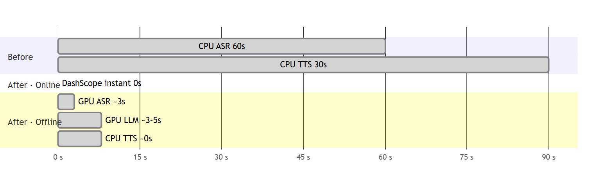
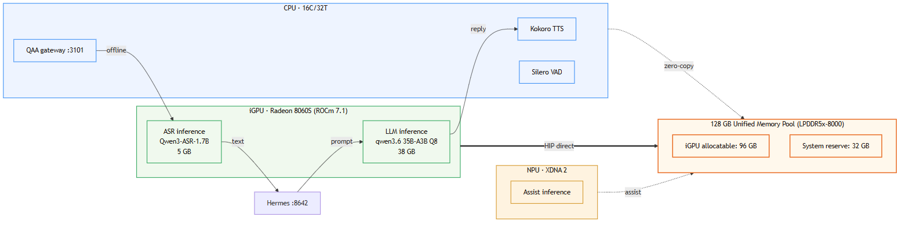
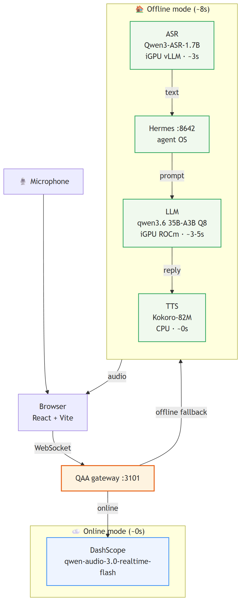
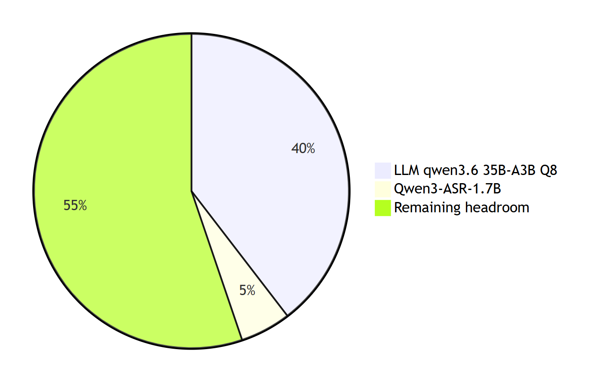
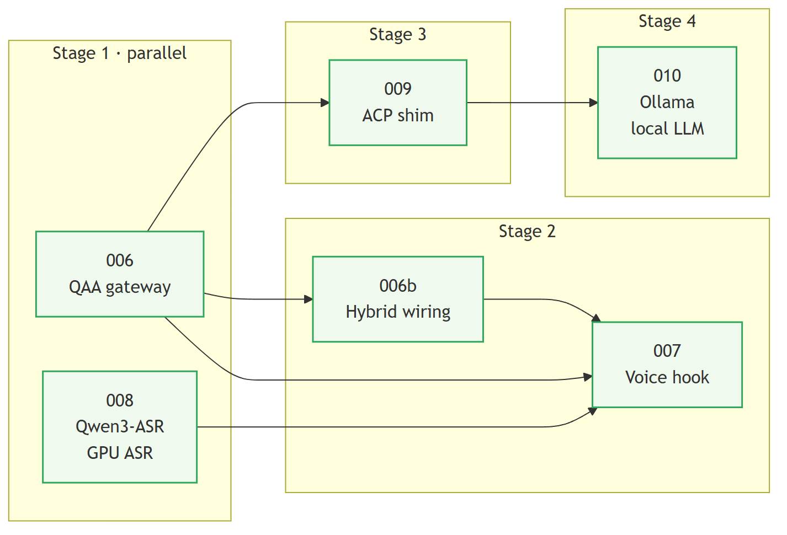
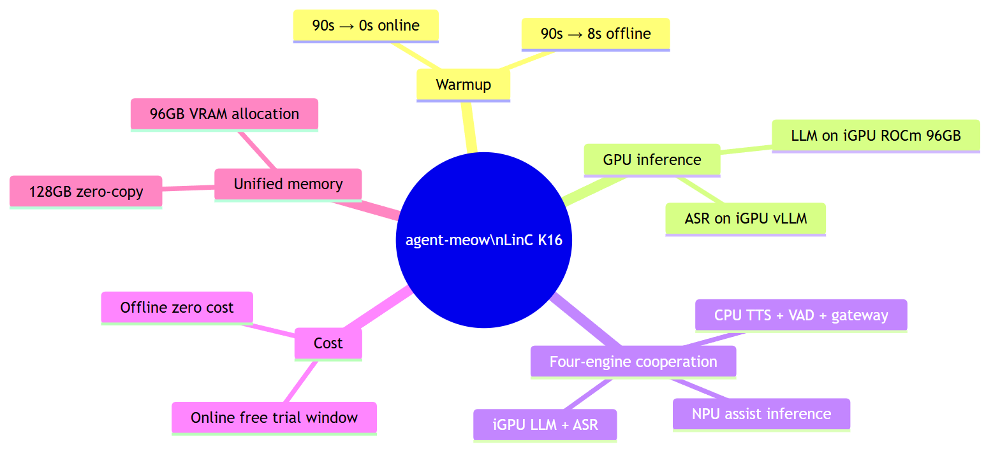
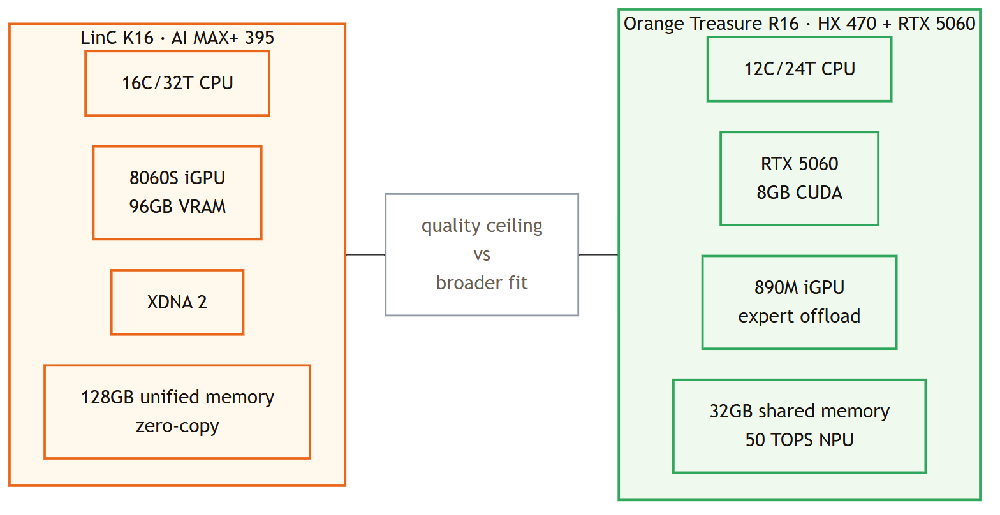
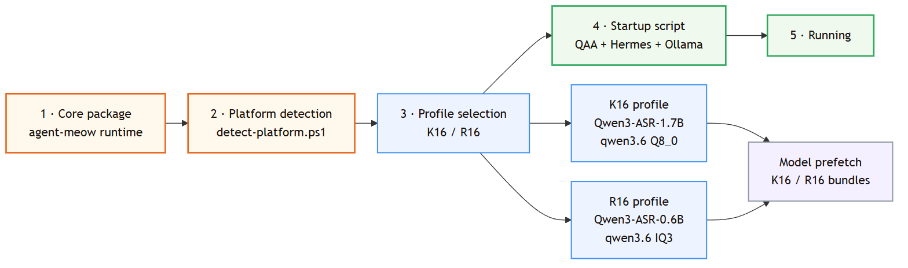

<!-- markdownlint-disable MD025 MD033 -->
<!-- MeowCat theme source: plans/themes/meowcat.css (mirrors web/src/index.css). -->

# agent-meow Scope Report

## LinC K16 · Full Scope 395

**One-line verdict**: turn a **90-second cold start** into a **near-0s online / ~8s offline** local voice agent.
**Runtime**: COLORFIRE LinC K16 · AMD Ryzen AI MAX+ 395 · 128GB unified memory · **Date**: 2026-08-05
**Status**: core delivery path is already landed on `origin/main`

> This version reads as architecture → takeaway → delivery path, not as a wall of technical notes.

---

# Executive Summary

**Core change**: move from CPU-bound serial waiting to an online fast path plus a parallel GPU-backed offline path.

| Online first response | Offline total warmup | Remaining VRAM |
| --------------------- | -------------------- | -------------- |
| **~0s**               | **~8s**              | **53GB**       |

- The voice entrypoint becomes a **QAA online / offline dual-mode** system.
- Both LLM and ASR can stay on the **Radeon 8060S**, avoiding cross-device shuffling.
- The NPU remains available as an assist lane for future WinML and local acceleration paths.

---

# Strix Halo Architecture Positioning

**One-line takeaway**: the subject of the 395 plan is **unified memory**, not an external GPU.

- **ROCm 7.1 is already active**, so Ollama can run directly on the 8060S through HIP.
- **96GB of allocatable VRAM** is enough for 35B-A3B Q8 plus 1.7B ASR to live together.
- The full chain stays on-device because a **zero-copy memory path** is the real design center.

---

# Voice Path: Speed Up the Front Door, Then Complete Offline

**The QAA gateway is the turning point of the roadmap.**

- **Online mode** goes straight to DashScope and drives first response toward zero.
- **Offline mode** links ASR, Hermes, LLM, and TTS into a practical local chain.
- **One front-end entrypoint** switches providers per session instead of duplicating the UI.

> That makes 006 / 006b more than “adding a gateway”: it turns the rest of the stack into swappable parts.

---

# Capacity Budget: Why This Machine Fits a 35B Local Voice Agent

**The LLM and Qwen3-ASR only consume 43GB together, leaving 53GB of actual headroom.**

| LLM      | ASR     | Allocatable iGPU VRAM |
| -------- | ------- | --------------------- |
| **38GB** | **5GB** | **96GB**              |

- That is enough for **LLM + ASR + runtime buffers** to coexist comfortably.
- K16 can prioritize **model quality** instead of being forced into aggressive down-quantization.
- The same pool still leaves expansion room for later Qwen3-TTS or Omni-style experiments.

---

# Delivery Map: 001–010 Is Really Four Stages

| Stage | Core move             | Result                                                           |
| ----- | --------------------- | ---------------------------------------------------------------- |
| 1     | 006 + 008 in parallel | Speed up the entrypoint and make local ASR real                  |
| 2     | 006b + 007            | Reconnect capability into MeowCat without changing the shell     |
| 3     | 009                   | Introduce Hermes so speaking and doing work stop being one layer |
| 4     | 010                   | Move the LLM home and close the loop                             |

> 001–005 still matter, but they are hygiene work. They no longer set the experience ceiling.

---

# Final Delivered Shape

**The core artifact is not a single model. It is the full workflow this machine can sustain.**

- **Instant online mode**: you can speak immediately.
- **Real offline mode**: voice still resolves end-to-end without the cloud.
- **No external GPU dependency**: CPU, iGPU, and NPU are enough for the whole path.
- **Upgrade runway remains open**: NPU, Qwen3-TTS, and WinML are still future levers.

---

# Dual-Platform Delivery: K16 as Quality Baseline, R16 as Broader Fit

**Conclusion**: K16 and R16 are not competitors. They are the two ends of the same product strategy: quality ceiling and mainstream CUDA coverage.

- K16 validates the **35B quality ceiling + fully local experience**.
- HX470 validates the **native CUDA adaptation path + broader hardware rollout**.
- Both keep the same agent-meow core, QAA gateway, and launch flow.

---

# Dual-Platform Delivery Path

**Delivery move**: mature the high-quality all-local path on K16 first, then package the profile-driven result for HX470.

- The unified installer distributes the agent-meow core.
- Platform profiles select models, memory strategy, and launch parameters.
- The startup script wires QAA, Hermes, and Ollama automatically.
