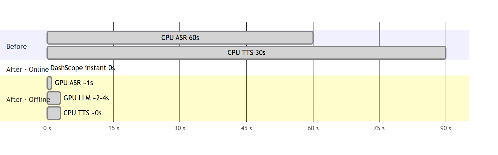
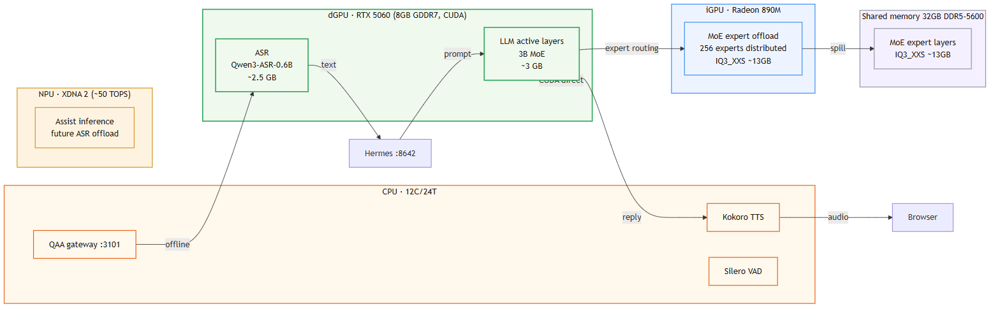
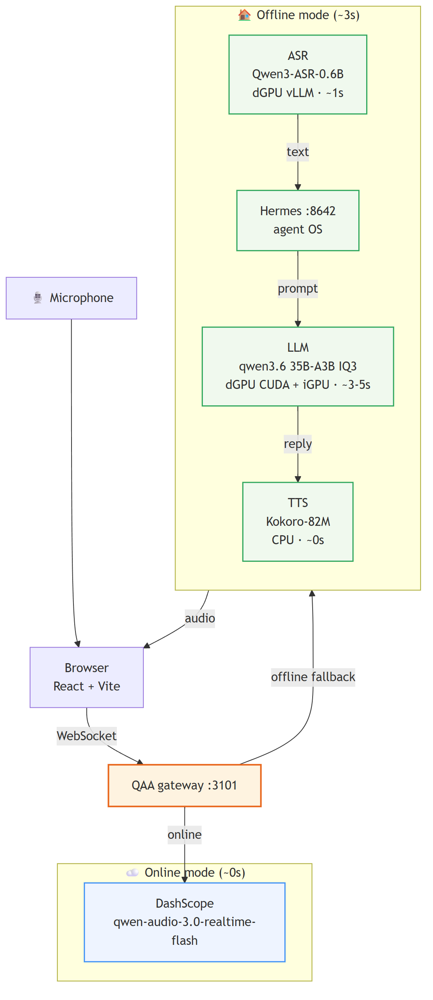
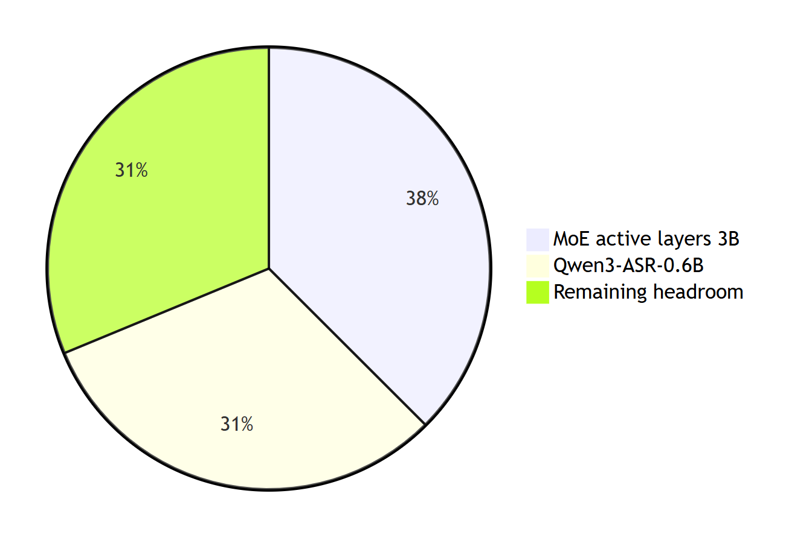
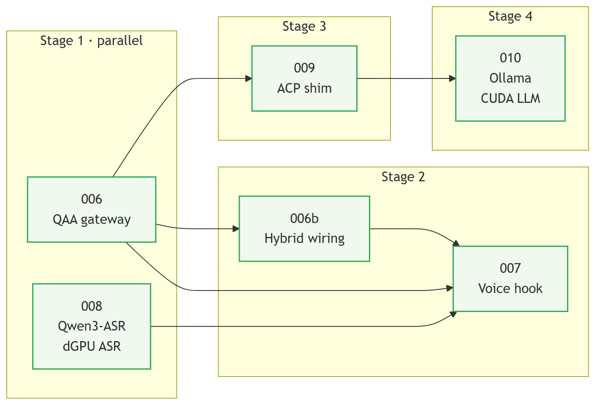
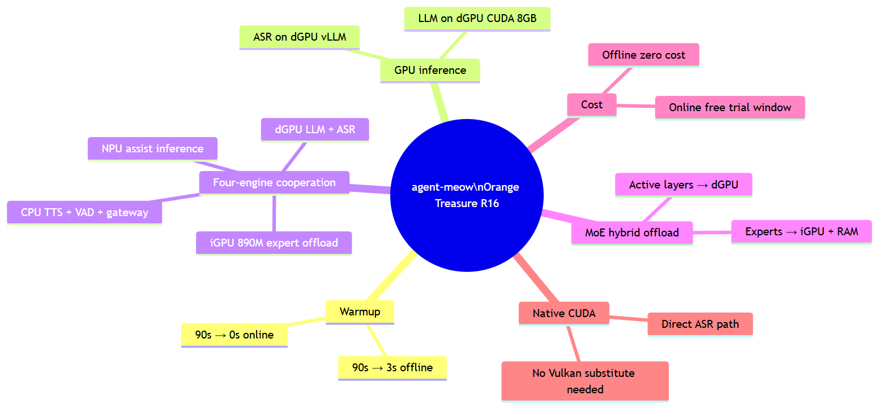

<!-- markdownlint-disable MD025 MD033 -->
<!-- MeowCat theme source: plans/themes/meowcat.css (mirrors web/src/index.css). -->

# agent-meow Scope Report

## Orange Treasure R16 · Full Scope HX470

**One-line verdict**: turn **8GB of CUDA VRAM + 32GB of shared memory** into a shippable four-engine local voice agent.
**Runtime**: AMD Ryzen AI 9 HX 470 + RTX 5060 Laptop · 32GB DDR5 · **Date**: 2026-08-05
**Status**: the implementation path is assessed and ready, sequenced after the K16 closeout

> This version focuses on why the machine can ship, not on listing every hardware term it contains.

---

# Executive Summary

**Core change**: cold start stops being dominated by CPU STT and moves into a CUDA ASR + local LLM fast path.

| Online first response | Offline total warmup | Remaining dGPU headroom |
| --------------------- | -------------------- | ----------------------- |
| **~0s**               | **~3s**              | **2.5GB**               |

- The real win is not “fit everything on one card.” It is **keep the hot path on dGPU and spill experts safely**.
- Native CUDA makes this path shorter and easier to land than the AMD Vulkan workaround route.
- That makes R16 the broader deployment surface, not just a smaller copy of K16.

---

# HX470 Hybrid Offload Architecture

**One-line takeaway**: the subject of the R16 plan is **hybrid division of labor**, not brute-forcing everything through 8GB of VRAM.

- **Native RTX 5060 CUDA support** removes the need for a special STT workaround path.
- **32GB of system memory** gives the expert layers and runtime buffers room to breathe.
- The real design is dGPU, iGPU, RAM, and NPU cooperating so 35B-A3B becomes operational.

---

# Voice Path: Online for Instant UX, Offline for CUDA Leverage

**For R16, the key is not a new front-end. It is the shortest possible offline path.**

- **Online mode** stays identical to K16 and preserves instant availability.
- **Offline mode** benefits directly from dGPU CUDA without AMD-style detours.
- **The MeowCat interaction layer stays unchanged**, so hardware differences do not leak to the user.

> In other words: same UX strategy as K16, shorter engineering path on R16.

---

# VRAM Budget: 8GB Can Host a 35B Voice Agent, But Only in Layers

**R16 becomes viable by pinning the active layers and ASR first, then letting the rest spill safely.**

| Active layers | ASR        | Remaining dGPU headroom |
| ------------- | ---------- | ----------------------- |
| **~3GB**      | **~2.5GB** | **~2.5GB**              |

- That is why R16 uses **Qwen3-ASR-0.6B** instead of 1.7B.
- The 35B-A3B family still stays aligned with K16, but on R16 it moves through **IQ3 + hybrid offload**.
- The tradeoff is clear: lower ceiling than K16, but still inside a practical shipping band.

---

# Delivery Map: Same Skeleton as K16, Lighter 008 Stage

| Stage | Core move             | Result                                                    |
| ----- | --------------------- | --------------------------------------------------------- |
| 1     | 006 + 008 in parallel | Fast entrypoint and real local ASR together               |
| 2     | 006b + 007            | Reconnect capability back into the MeowCat front-end      |
| 3     | 009                   | Introduce Hermes to separate speaking from tool execution |
| 4     | 010                   | Land the local CUDA LLM and close the loop                |

> The real simplification is that **008 is close to install-and-run**, not a custom compatibility project.

---

# Final Delivered Shape

**R16 turns four-engine coordination from a flagship experiment into a broadly shippable machine profile.**

- **Native CUDA** shortens and clarifies the offline path.
- **Hybrid offload** turns an 8GB dGPU into a real 35B-A3B entrypoint.
- **The product shape stays the same**: QAA + Hermes + Ollama + MeowCat.
- **Future extensions remain open** through the iGPU 890M and the NPU lane.

---

# Dual-Platform Delivery: R16 Broadens the Fit, K16 Preserves the Ceiling

**Conclusion**: R16 does not replace K16. It extends the same product to a more common class of hardware.

- K16 proves the **high-quality all-local path**.
- R16 proves the **mainstream CUDA + hybrid offload delivery path**.
- Both keep the same agent-meow core, QAA gateway, Hermes, and profile-driven launch flow.

---

# Dual-Platform Delivery Path

**Delivery move**: mature the high-quality all-local path on K16 first, then package the profile-driven result for HX470.

- The unified installer distributes the agent-meow core.
- Platform profiles select models, memory strategy, and launch parameters.
- The startup script wires QAA, Hermes, and Ollama automatically.
