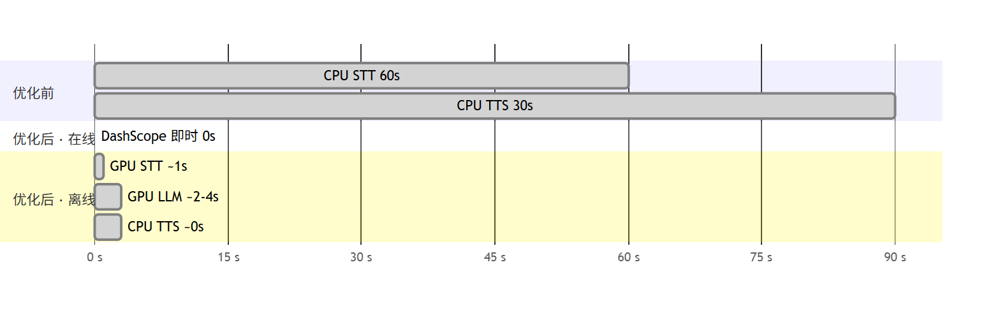
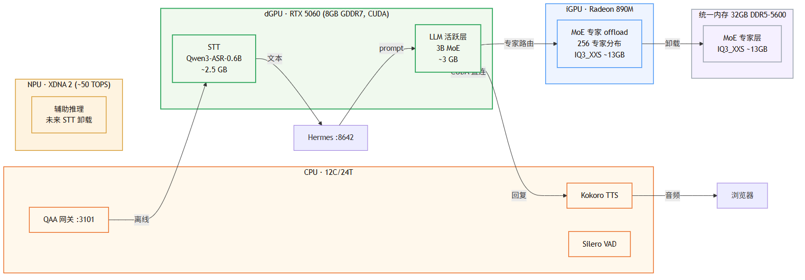
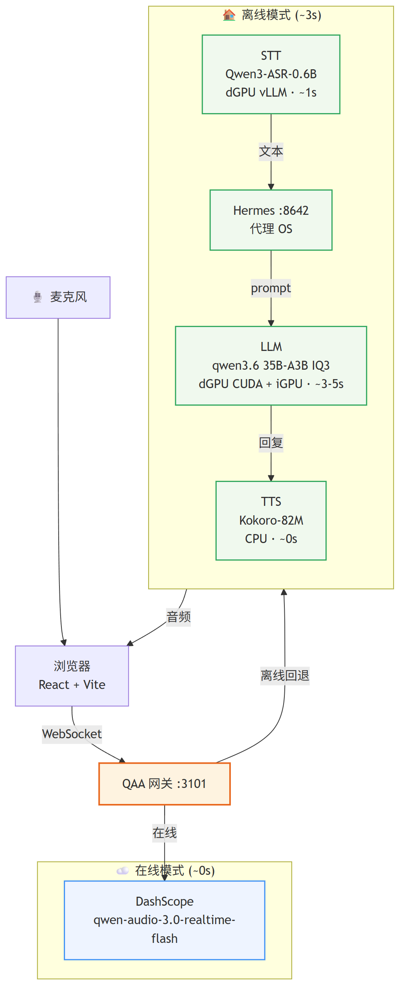
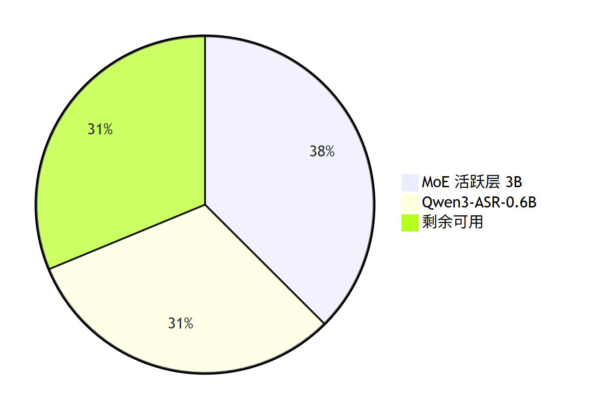
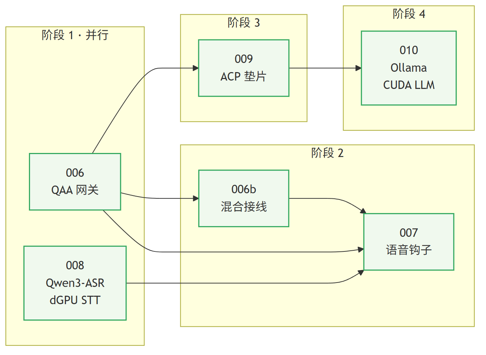
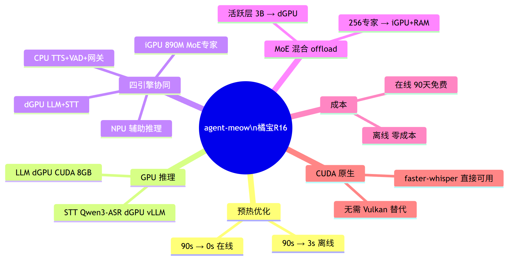
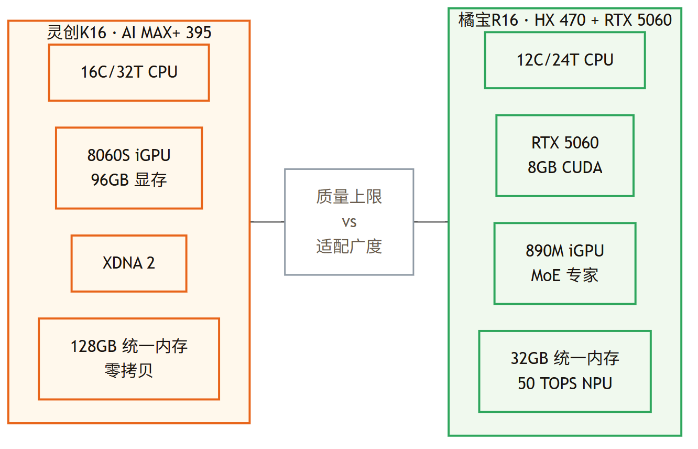
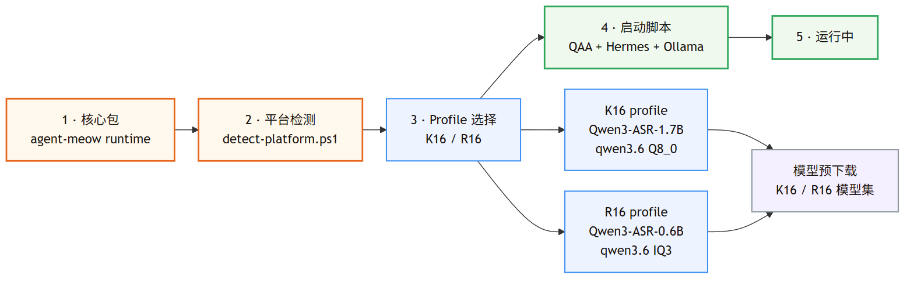

<!-- markdownlint-disable MD025 MD033 -->
<!-- MeowCat theme source: plans/themes/meowcat.css (mirrors web/src/index.css). -->

# agent-meow 实施范围报告

## 橘宝R16 · Full Scope HX470

**一句话结论**：把 **8GB CUDA + 32GB 统一内存** 组织成可交付的四引擎本地语音代理。
**运行环境**：AMD Ryzen AI 9 HX 470 + RTX 5060 Laptop · 32GB DDR5 · **日期**：2026-08-05
**状态**：落地路径已完成评估，收口顺序排在 K16 之后

> 这份版本强调“为什么它能交付”，而不是继续堆硬件名词和参数表。

---

# 一页结论

**冷启动的核心变化**：不再被 CPU STT 拖住，而是由 CUDA ASR + 本地 LLM 接管关键耗时段。

| 在线首响 | 离线总预热 | dGPU 剩余空间 |
| -------- | ---------- | ------------- |
| **~0s**  | **~3s**    | **2.5GB**     |

- 真正决定可行性的不是“大模型全装下”，而是 **活跃层先落 dGPU、专家层再外溢**。
- CUDA 原生让这条路线比 AMD Vulkan 替代方案更直、更快落地。
- 因此 R16 更像“规模化硬件适配面”，不是 K16 的低配复制品。

---

# HX470 混合 offload 架构

**一句话**：R16 的主语是 **混合分工**，不是“让 8GB 卡硬扛一切”。

- **RTX 5060 的 CUDA 原生支持** 让语音入口不需要绕路到 Vulkan 替代。
- **32GB 系统内存** 给专家层与系统缓冲留出生存空间。
- 这套机器的关键不是单 GPU 闭环，而是 dGPU、iGPU、RAM、NPU 协同拆解 35B-A3B。

---

# 语音链路：在线抢即时性，离线吃 CUDA 红利

**对 R16 而言，最重要的不是换前端，而是换最短离线链路。**

- **在线模式** 与 K16 一样，负责即时可用与低接入成本。
- **离线模式** 直接吃到 dGPU CUDA，减少 AMD 路线里的替代和编译成本。
- **同一套 MeowCat 交互层** 保持不动，避免把硬件差异暴露给最终用户。

> 换句话说，R16 的 UX 策略和 K16 一样，但它的工程路径更短。

---

# 显存预算：8GB 也能做 35B 语音代理，但必须分层

**R16 的可行性来自“活跃层 + ASR 先稳定驻留”，而不是全模型常驻。**

| 活跃层   | ASR        | dGPU 余量  |
| -------- | ---------- | ---------- |
| **~3GB** | **~2.5GB** | **~2.5GB** |

- 这就是为什么 R16 选 **Qwen3-ASR-0.6B** 而不是 1.7B。
- 35B-A3B 继续保留模型家族一致性，但在 R16 上采用 **IQ3 / 混合 offload**。
- 结果是：质量略低于 K16 上限，但依然维持在“可交付”区间。

---

# 实施地图：R16 沿用 K16 路线，008 更轻

| 阶段 | 核心动作       | 结论                            |
| ---- | -------------- | ------------------------------- |
| 1    | 006 + 008 并行 | 入口和本地 ASR 同时推进         |
| 2    | 006b + 007     | 把 QAA 能力接回 MeowCat 前端    |
| 3    | 009            | 引入 Hermes，说话与工具执行解耦 |
| 4    | 010            | 落地本地 CUDA LLM，形成闭环     |

> R16 的 **008 基本装好就跑**，无需自救 GPU 兼容链。

---

# 最终交付形态

**R16 的最终价值，是把四引擎协同从“旗舰实验”变成“普遍可交付硬件形态”。**

- **CUDA 原生** 让离线路径更直观、更好交付。
- **混合 offload** 把 8GB dGPU 变成足以承载 35B-A3B 的入口。
- **同一套产品形态** 仍然是 QAA + Hermes + Ollama + MeowCat 前端。
- **未来扩展** 还可以继续吃 iGPU 890M 与 NPU 的增益。

---

# 双平台交付：R16 负责铺开适配面，K16 负责守住质量上限

**结论**：R16 不是替代 K16，而是把这套产品从“旗舰验证”推进到“更广泛机器可落地”。

- K16 证明了 **高质量全本地链路** 可以成立。
- R16 证明了 **主流 CUDA 硬件 + 混合 offload** 也能把产品真正交付出去。
- 两者共享同一套 agent-meow 核心、QAA 网关、Hermes 与 profile 化启动脚本。

---

# 双平台交付路径

**交付动作**：先以 K16 打磨高质量全本地链路，再把 profile 化成果打包到 HX470。

- 统一安装包负责分发 agent-meow 核心。
- 平台 profile 负责选择模型、显存策略与启动参数。
- 启动脚本负责自动配置 QAA、Hermes 与 Ollama。
