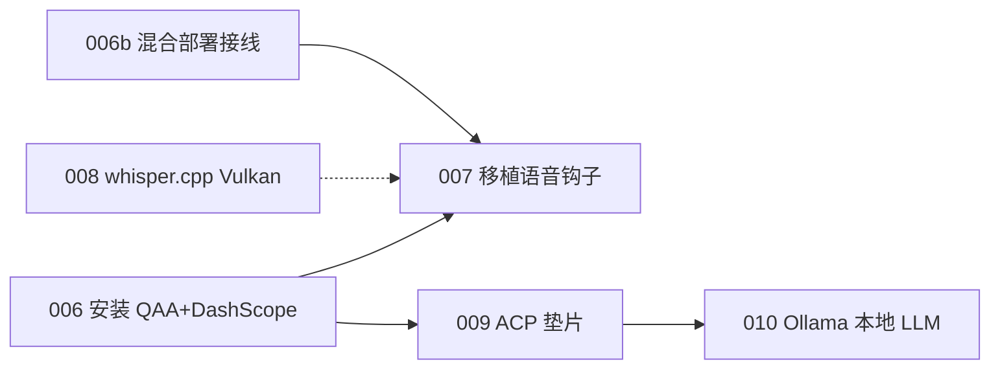

# agent-meow 实施范围报告
## 计划 001–010 · 完整实施路线图

### 运行环境：Colorfire Meow Series R16 395 AI 笔记本
### AMD Ryzen AI MAX+ 395 (Strix Halo) · CPU + NPU + iGPU 全栈优化

---

# 硬件平台

## Colorfire Meow Series R16 395 AI 笔记本

| 组件 | 规格 | 状态 |
|------|------|------|
| **CPU** | AMD Ryzen AI MAX+ 395，16 核 Zen5/Zen5c，32 线程，3.0GHz | ✅ 已验证 |
| **iGPU** | AMD Radeon 8060S 集成显卡，Vulkan 1.4.329 | ✅ 已验证 |
| **iGPU 显存** | **96GB**（统一内存架构，驱动确认） | ✅ 已验证 |
| **NPU** | AMD XDNA 2 NPU（PCI 设备已识别） | ✅ 已验证 |
| **系统内存** | 32GB DDR5 | ✅ |
| **ROCm** | AMD ROCm 7.1 + HIP 7.1.51803 | ✅ 已安装 |
| **Vulkan SDK** | vulkaninfo 1.4.329 | ✅ 可用 |
| **Ollama** | 0.32.5，meow36b (38GB) + qwen3.6:35b-a3b (38GB) | ✅ 已安装 |
| **品牌** | COLORFIRE LinC K16（喵星系列 R16 395 AI） | BIOS 确认 |

---

# 为什么 Strix Halo 让 agent-meow 独特

## 统一内存 + 三引擎并行

普通 PC 架构：CPU 做计算，GPU 做图形，NPU 不存在。
**Strix Halo 架构**：CPU + iGPU(96GB显存) + NPU 三引擎并行，共享统一内存池。

```
┌──────────────────────────────────────────────┐
│        Colorfire R16 395 AI · Strix Halo      │
│        32GB RAM · iGPU 96GB 显存              │
│                                              │
│   CPU (16核)          iGPU (8060S)           │
│   ├─ Kokoro TTS       ├─ Ollama qwen3.6 LLM  │
│   ├─ VAD Silero       │  (38GB → 96GB 显存)   │
│   ├─ QAA 网关         └─ whisper.cpp STT     │
│   └─ Vite 前端           (Vulkan GPU 加速)    │
│                                              │
│   NPU (XDNA 2)                               │
│   └─ 未来: NPU STT (待 2026 末)              │
└──────────────────────────────────────────────┘
```

**独特价值**：agent-meow 是唯一为 Strix Halo 三引擎架构优化的
端到端本地 AI 语音代理——LLM 在 GPU、STT 在 GPU、TTS 在 CPU、
NPU 留给未来。零云端依赖，零外部 GPU。

---

# 计划 001–005：基础设施修复

## 已完成的文档/路线图修复

| # | 计划 | 状态 | 内容 |
|---|------|------|------|
| 001 | 修复 db_models 路径引用 | TODO | 路径精确化 |
| 002 | 同步 VIDEOS_SURFACE.md | TODO | 2 项过时声明 |
| 003 | Phase 4 runner 调度 | TODO | 注册 surface+voice 工具到 runner |
| 004 | 标记过时 voicebox 计划 | TODO | 清理废弃计划 |
| 005 | Voicebox 引擎可靠性 | DRAFT | 预 QAA 时代的可靠性方案 |

这些是 2026-07-24 审计的基础设施修复，优先级低于 QAA 语音迁移。

---

# 计划 006：安装 QAA 网关 + DashScope 云端

## 在线语音模式 · 解决 90 秒预热

**核心**：安装 qwen-audio-agent (QAA) 作为语音网关，配置 DashScope 云端
`qwen-audio-3.0-realtime-flash` 模型。

| 指标 | 当前 | 优化后 |
|------|------|--------|
| 预热时间 | 90 秒 | **~0 秒**（云端常驻） |
| 中文支持 | ✅ | ✅（原生） |
| 成本 | 免费（本地） | 90 天免费，之后 ~¥0.20/分钟 |
| 网络需求 | 无 | 需要互联网 |

**步骤**：获取 DashScope API 密钥 → 安装 QAA → 配置 → 冒烟测试
**风险**：LOW · **工作量**：S

---

# 计划 006b：在线/离线混合部署接线

## 浏览器 → QAA → DashScope/S2S 的完整连接

**核心**：解释如何将 QAA 网关接入 agent-meow 浏览器仪表盘，
以及用户如何在在线/离线之间切换。

```
浏览器 (:5173)
  → Vite 代理 (/api → :3101, ws:true)
    → QAA 网关 (:3101)
      ├─ ☁️ 在线 → DashScope 云端 (~0s)
      ├─ 🏠 离线 → 本地 S2S (:8765)
      └─ 工具调用 → Hermes/Ollama 后端
```

**关键配置**：Vite `server.proxy` 的 `ws: true` 启用 WebSocket 代理
**自动回退**：DashScope 不可用时自动切离线

---

# 计划 007：移植 QAA 实时语音钩子到 MeowCat 界面

## 保留猫爪 UI，替换底层传输

**核心**：将 QAA 的 `useRealtimeVoice.js` 移植到 agent-meow 的
`VoicePanel.tsx`，保留猫爪麦克风按钮 + 波形动画 + MeowCat IP 图案。

| 旧组件 | 新组件 | 动作 |
|--------|--------|------|
| `realtimeVoice.ts` (手写) | QAA `useRealtimeVoice.js` | **替换** |
| `s2s_proxy.py` (FastAPI) | QAA 网关 | **替换** |
| 猫爪按钮 + 波形 | 保留 | 不变 |
| 在线/离线切换器 | 新增 | ☁️/🏠 切换 |

**协议差异**：QAA 使用 `GatewayClientEvent` 协议（非原始 OpenAI Realtime），
需重写事件处理器。
**风险**：MED · **工作量**：L

---

# 计划 008：whisper.cpp + Vulkan GPU 加速 STT

## 离线预热优化 · GPU 从闲置到全速

**根因**：faster-whisper (CTranslate2) 只支持 CUDA，无法用 AMD GPU。
**96GB iGPU 显存完全闲置**，STT 在 CPU 上跑 60 秒。

**方案**：whisper.cpp 支持 Vulkan (`GGML_VULKAN=1`) 和 ROCm (`GGML_HIP=1`)，
将 STT 放到 Radeon 8060S 上运行。

| 组件 | 当前 | 优化后 | 运行位置 |
|------|------|--------|---------|
| STT | CPU 60 秒 | **GPU ~3 秒** | iGPU (Vulkan) |
| TTS | CPU 30 秒 | **~0 秒**（预热） | CPU |
| 总预热 | **90 秒** | **~8 秒** 或 ~0 秒 | — |

**96GB iGPU 显存**足以同时容纳 whisper 模型 + Ollama LLM 模型。
**风险**：MED · **工作量**：M

---

# 计划 009：ACP 垫片 → Hermes 代理 OS 后端

## 非阻塞工具调用语音（Path B）

**核心**：QAA 的后端代理通过 ACP 协议连接 Hermes，实现"边说话边工作"——
用户说话时 Hermes 在后台执行代码、操作文件、调用 MCP 工具，完成后
语音播报结果。

```
用户说话 → QAA 实时前端 → 简单问题即时回答
         → QAA spawn_thinking → ACP 垫片 → Hermes/Ollama
           → 工具调用（代码/文件/MCP）
           → 完成后语音播报结果
```

**Hermes = 代理 OS**：Hermes 不仅是 LLM，它是完整的 agent 框架——
skills（技能）、memory（记忆）、cron（定时任务）、terminal（终端访问）、
MCP 服务器集成。ACP 垫片让语音成为 Hermes 的一等交互界面。

**风险**：MED · **工作量**：L

---

# 计划 010：本地 Ollama LLM · 全栈 AMD Strix Halo 优化

## 从 Hermes Docker 到完全本地 GPU 推理

**核心**：用 Ollama 本地运行 `qwen3.6:35b-a3b` 模型替代 Hermes Docker，
利用 Strix Halo 的 96GB iGPU 显存和 ROCm 7.1 加速。

| 指标 | Hermes Docker | Ollama 本地 |
|------|-------------|-------------|
| 内存 | ~1-2GB (Linux VM) | ~0 (原生进程) |
| 启动 | ~5-10s | ~3s |
| 推理 | 远程 API | **GPU 本地 (ROCm)** |
| 延迟 | ~1.8ms (Docker 代理) | **~0.3ms** (原生) |
| 模型 | 固定 | **可切换** |
| 成本 | API 费用 | **零成本** |

**38GB 模型在 96GB iGPU 显存中**：充裕，无内存交换。
**风险**：MED · **工作量**：M

---

# 完整 Strix Halo 优化栈

## CPU + iGPU + NPU 三引擎分工

| 组件 | 引擎 | 运行位置 | 预热 | 计划 |
|------|------|---------|------|------|
| **LLM** (qwen3.6:35b) | Ollama + ROCm | **iGPU** (96GB VRAM) | ~3-5s | 010 |
| **STT** (Whisper) | whisper.cpp + Vulkan | **iGPU** | ~3s | 008 |
| **TTS** (Kokoro) | Kokoro-82M | **CPU** (16核) | ~0s 预热 | 008 |
| **VAD** (Silero) | Silero | **CPU** | ~0s | 现有 |
| **语音网关** | QAA (Node.js) | **CPU** | ~2s | 006 |
| **代理 OS** | Hermes / Ollama | **CPU + iGPU** | 已运行 | 009/010 |
| **前端** | React + Vite | **浏览器** | 即时 | 007 |
| **NPU STT** | 未来 (winml) | **NPU** | 待 2026 末 | 未来 |

**关键**：iGPU 96GB 显存同时容纳 LLM (38GB) + STT (1.5GB) = 39.5GB，
剩余 56.5GB 充裕。CPU 专注 TTS + VAD + 网关。NPU 留给未来 STT 加速。

---

# 依赖关系与执行顺序



| 阶段 | 计划 | 可并行 |
|------|------|--------|
| **阶段 1** | 006 + 008（并行） | ✅ 独立 |
| **阶段 2** | 006b + 007 | 依赖 006 |
| **阶段 3** | 009 | 依赖 006 |
| **阶段 4** | 010 | 依赖 009 |

---

# 预期最终效果

## Colorfire R16 395 AI 上的 agent-meow 全栈

| 指标 | 当前 | 最终目标 |
|------|------|---------|
| 语音预热 | **90 秒** | **~0 秒**（在线）/ ~8 秒（离线） |
| LLM 推理 | 远程 API / Docker | **本地 GPU (ROCm, 96GB VRAM)** |
| STT 推理 | CPU (60 秒) | **GPU Vulkan (~3 秒)** |
| TTS 预热 | 30 秒 | **~0 秒**（开机预热） |
| 云端依赖 | 必须 | **可选**（混合模式） |
| 成本 | API 费用 | **零**（离线）/ ~¥0.20/分钟（在线） |
| GPU 利用率 | **0%**（闲置） | **STT + LLM 在 GPU** |
| NPU 利用率 | **0%**（闲置） | 未来 STT 加速 |
| Docker 依赖 | 必须 | **可选**（Ollama 替代） |
| 代理能力 | 无 | **Hermes 代理 OS（代码/文件/MCP）** |

**agent-meow 在 Colorfire R16 395 AI 上的独特定位**：唯一为 Strix Halo
三引擎架构（CPU + iGPU + NPU）全面优化的本地 AI 语音代理——
LLM 在 GPU 跑（Ollama + ROCm），STT 在 GPU 跑（whisper.cpp + Vulkan），
TTS 在 CPU 跑（Kokoro），代理 OS 在后台跑（Hermes），NPU 留给未来。
全部组件共享 96GB 统一显存，零云端依赖，零外部 GPU 需求。