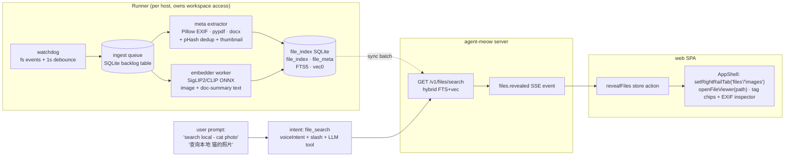

# Plan 039: File Intelligence — deep-dive research + target architecture

> **For agentic workers:** REQUIRED SUB-SKILL: Use superpowers:subagent-driven-development (recommended) or superpowers:executing-plans to implement this plan task-by-task. Steps use checkbox (`- [ ]`) syntax for tracking.

**Goal:** Replace the "no-go for clients" auto-tag pipeline (plans 037/038) with an event-driven, workspace-scoped file index: drop a file into the agent-meow workspace → it is detected in ~1s, EXIF/metadata extracted deterministically, semantic tags generated locally, and the right panel (Files/Images/Docs) shows everything. A user prompt like `search local - cat photo` / `查询本地 猫的照片` resolves against the index and **auto-opens the right panel on the matches**.

**Architecture:** A runner-side **watcher + ingestion pipeline** (watchdog events, not polling) feeds a **workspace-scoped SQLite index** (`file_index` + `file_meta` + FTS5 + sqlite-vec). Deterministic metadata (EXIF date/GPS/camera via Pillow; doc text via pypdf/python-docx) is extracted in-process — no LLM. Vision semantics use a **local ONNX CLIP/SigLIP embedder** (runs on this Strix Halo box CPU/iGPU; reuses the existing sherpa-onnx/onnxruntime stack where possible). The agent LLM is demoted to an optional *suggester* (Paperless-ngx pattern), never the ingestion path. Search is hybrid (FTS5 keyword + vector cosine); results flow to the UI via a `files.search` REST endpoint + an SSE "reveal" event that drives AppShell's existing `setRightRailTab`/`openFileViewer` seam.

**Tech Stack:** Python 3.12 (watchdog, Pillow, pypdf, python-docx, sqlite-vec, onnxruntime or sherpa-onnx CLIP), SQLite FTS5, FastAPI, React/TypeScript (Zustand store action + SSE event), existing `_IMAGE_TOOLS` runner dispatch pattern.

**Spec:** Supersedes the ingestion path of `plans/037-vision-model-file-tagging.md` and `plans/038-auto-tag-search-prediction.md`. Keeps `image_analyze`/`file_tags` for agent-authored semantic tags but stops making them the only path.

---

## 1. Root-cause audit — why 037/038 fails for clients (verified in code, 2026-08-30)

| # | Bottleneck | Evidence |
|---|---|---|
| 1 | **Polling, top-level only, images only** — up to 5 min + 10 min cooldown before a new file is noticed; subfolders and docs never | `background_file_watcher.py` `_scan_workspace_images()` = `os.scandir` (no recursion), `_IMAGE_EXTENSIONS` only, interval 300s / cooldown 600s |
| 2 | **Ingestion goes through the chat agent** — watcher posts "请分析工作区中的所有图片…" and hopes the 35B vision LLM cooperates; VRAM burn, non-deterministic, slow | `_ANALYZE_PROMPT` in `background_file_watcher.py`; `ChatPoster` posts to `/v1/sessions/{id}/events` |
| 3 | **Conversation-scoped tags** — a file tagged in session A is invisible to session B; "search my local files" can't work across the workspace | `FileTag.conversation_id` is the partition key in `file_tag_store`; `search_by_tag` calls `list_for_conversation()` |
| 4 | **Zero EXIF** — no date/GPS/camera/orientation extraction anywhere; plan 037's own "Phase 2: EXIF" was never built | grep: no Pillow/exif lib in `pyproject.toml`; `file_tags` stores only `(file_path, tag, description)` |
| 5 | **Search never drives the UI** — `search_by_tag` returns JSON to the agent; the right panel has no "reveal these files" path | `_execute_search_by_tag` in `tool_dispatch.py`; FilesPanel has no external-selection seam |
| 6 | **Exact-tag-only matching** — "cat" ≠ "kitten"; no fuzzy, no semantic, no keyword scoring | `matching = [t for t in all_tags if t.tag == tag]` |
| 7 | **No docs path at all** — `DocumentStore` is user-authored markdown (Docs surface), not file ingestion; no text extraction, no OCR | `stores/document_store/__init__.py` docstring |
| 8 | **No dedup/thumbnails** — every rescan re-posts the same files; no content hash, no cached previews | no hash column in `file_tags` |

**Verdict:** the design inverted the responsibility split. Every serious comparator (below) puts *deterministic metadata extraction* in a file-driven consumer and reserves the LLM for *suggestions*. That is the fix.

## 2. Landscape comparison — what the good ones do

| System | Type | Ingestion | Metadata | Tags/semantics | Search | License | Takeaway for agent-meow |
|---|---|---|---|---|---|---|---|
| **Immich** | self-host photos | upload + library scan jobs | EXIF via Go, reverse-geocode (offline cities.db) | CLIP embeddings (job queue), smart tags (OCR+facial optional) | Postgres + **VectorChord** pgvector — free-text CLIP search; **multilingual CLIP (xlm/siglip2) understands any query language** | AGPL-3.0 (methodology only) | Job queue decouples scan→extract→embed; CLIP is THE answer for "find cat photo"; multilingual models fit our ZH users |
| **PhotoPrism** | self-host photos | `photoprism index` incremental scan | **EXIF, XMP, GPS→place, orientation, perceptual hash (dedup), dominant colors** | TensorFlow label generation + caption via Ollama/OpenAI (optional) | own query language (`camera:iphone before:2026 type:photo`) | AGPL/Apache split | The **perceptual-hash dedup + pHash-on-ingest** pattern; query-language design for filters |
| **Paperless-ngx** | self-host docs | **consumer: folder-watch (inotify) + polling fallback, canonical filenames, duplicate detection** | date/title from filename pattern, ASN | **Two-tier: co-occurrence Matcher (zero-ML, instant) + scikit-learn NB Classifier (trained, local)**; v3 adds LLM suggestions that are *suggested, not auto-applied* | **tantivy** full-text | GPL-3.0 (methodology only) | The single best pattern for us: **auto-tagging must not need an LLM**; co-occurrence + classifier covers 90%; LLM stays advisory |
| **Eagle / Billfish** | desktop DAM (prosumer) | drag-drop watch folder | EXIF shown in inspector | manual + smart folders | instant local index | commercial (UX reference) | UX bar: inspector panel with full metadata, smart folders = saved queries |
| **Recoll / Locate33 / Everything** | desktop file search | background index | n/a | n/a | instant filename + full-text | GPL / freeware | Filename search is already free via FilesPanel Explore; not our gap |
| **Google Photos / OneDrive / iCloud** | cloud | upload → server pipeline | EXIF server-side | on-device + server ML, face clustering | semantic free-text | closed | Feature bar clients expect: "photos of the beach last summer" works with zero manual tags |
| **Khoj** | OSS personal AI second brain | **watchdog folder watch → markdown/pdf/org ingestion → local embeddings (sentence-transformers) → hybrid search** | n/a | local BGE embeddings | **hybrid (FTS + vector) with reranking** | AGPL-3.0 | Closest architectural sibling: local-first, embedder service, incremental watch-index. Study its `watcher` + `ingest` split |
| **sqlite-vec** | embeddable extension | n/a | n/a | n/a | vec0 virtual table KNN, metadata filtering | **MIT/Apache — code-ready** | Our vector store: same SQLite file as the index, no new service, Windows-native, pip-installable |
| **sherpa-onnx** | OSS inference runtime | n/a | n/a | **ships `cli-image-embedder` (CLIP)** | n/a | Apache-2.0 — **already a declared extra in our pyproject** | Candidate embedder runtime — reuse the dictation stack's dependency instead of adding onnxruntime |

## 3. Adoptable repos (code-reuse verdicts)

| Dependency | License | Role | Notes |
|---|---|---|---|
| `sqlite-vec` | MIT/Apache | vector KNN inside our existing SQLite | `pip install sqlite-vec`; loads as extension; `vec0` table with file_id partition key |
| `Pillow` | MIT-CMU | **EXIF extraction** (`Image._getexif`, `getexif()`), thumbnails, orientation | also gives us `ImageOps.exif_transpose` for correct previews |
| `watchdog` | Apache-2.0 | inotify/ReadDirectoryChangesW file events | runner-side; 1s debounce, skip `_SKIP_NAMES` |
| `pypdf`, `python-docx` | MIT / MIT | doc text extraction (PDF/DOCX) for FTS | phase 2; `docling` (MIT) if layout-aware parsing is ever needed — heavier |
| `exifread` | GPL-2.0 | ⚠ avoid — Pillow covers our EXIF needs | license contamination risk |
| CLIP embedder: `sherpa-onnx` CLIP **or** `onnxruntime` + `immich-app/ViT-B-16-SigLIP2__webli` (~350MB ONNX) | Apache-2.0 / model licenses | image+text → 512/768-d embedding | **smoke-test first**: this box (Ryzen AI MAX+ 395, 128GB, 8060S Vulkan) runs these trivially on CPU; siglip2/xlm models are cross-lingual — ZH query finds EN-tagged pic ("猫" → cat photos) |
| SQLite **FTS5** | built-in | keyword full-text over name+EXIF-words+doc text | zero new deps; trigram tokenizer for CJK substring matching |

## 4. Target architecture

**Key decisions (each justified by the audit):**

1. **Workspace-scoped, not conversation-scoped.** `file_index` keys on `(host_id, workspace_path, file_path)` with a content hash; every session viewing that workspace shares the index. Fixes bottleneck #3.
2. **Deterministic first, LLM never on the hot path.** EXIF/date/GPS/camera/text extract in-process at ingestion (fixes #2, #4). Vision semantics = local CLIP embedding (no LLM). The agent's `image_analyze` remains for *agent-authored* labels, written to the same index as a tag source (`source='agent'`).
3. **Hybrid search = FTS5 (trigram) + sqlite-vec cosine, merged with RRF.** Handles exact keywords, CJK substrings, and semantic queries ("日落的海边" finds beach photos) in one endpoint. Fixes #6.
4. **Panel reveal is a first-class product feature, not agent JSON.** `GET /v1/files/search` returns ranked `{path, score, meta, tags, thumb}`; the agent's `search_files_semantic` tool (rename of search_by_tag) *and* the UI both call it. On an intent-classified file search the server emits `files.revealed` SSE → AppShell opens the rail tab + selects files (the seam already exists: `setRightRailTab`, `openFileViewer`, `selectedFilePath` in `AppShell.tsx:146-275`). Fixes #5.
5. **Intent trigger.** New `file_search` intent in `web/src/lib/voiceIntent.ts` (extends existing EN/ZH verb lists) + explicit prefixes `search local -`, `查询本地`, `搜本地`, `/find <query>` (slash command). A `file_search` hit routes straight to the search endpoint and renders results as an inline **file-result card** in the chat (click → reveal in panel) instead of a normal agent turn; the agent also gets the tool for implicit asks ("where's that invoice?").
6. **Watcher lives in the runner, not the server.** The runner already owns host filesystem access (the whole reason `_fs_get_with_host_fallback` exists); watchdog in the runner avoids the server-never-sees-host-paths problem entirely. Server gets batches via the existing runner tunnel.

## 5. Phased implementation

### Phase 0 — Index spine (deterministic, no ML) — *the client-blocker fix*
- [ ] **Task 0.1** `agent_meow/stores/file_index_store/`: `file_index` (id, host_id, workspace, path, kind, size, mtime, content_hash UNIQUE per workspace, status), `file_meta` (json: exif{date,gps lat/lon,camera,lens,orientation}, doc{title,pages,words}, phash), Alembic migration. Unit suite `tests/stores/test_file_index_store.py`.
- [ ] **Task 0.2** `agent_meow/runner/file_watcher.py`: watchdog Observer per session workspace (reuse `_resolve_session_fs` path rules), 1s debounce, `_SKIP_NAMES` parity with `workspace_scan`, enqueue into `file_index` (`status='pending'`). Recursive — fixes top-level blindness. Tests with tmp_path + inotify/`ReadDirectoryChangesW` via `Observer` smoke.
- [ ] **Task 0.3** `agent_meow/runner/file_meta_worker.py`: asyncio consumer of `status='pending'`: Pillow EXIF (incl. GPS), pHash (imagehash-style 64-bit, hand-rolled DCT to avoid a dep), thumbnail → `artifacts/` store, pypdf/python-docx text for docs; **no new vision model**. Deps: add `pillow`, `watchdog`, `pypdf`, `python-docx` to `[project.dependencies]` (all MIT/Apache — re-check plan-037 "no new dependencies" constraint is explicitly lifted here).
- [ ] **Task 0.4** Wire watcher lifecycle into runner session start/stop; `AGENT_MEOW_FILE_WATCH=on/off` (default on when workspace bound). Kill `BackgroundFileWatcher`'s chat-poster loop (keep class as fallback poller for network mounts that don't fire events).
- [ ] **Task 0.5** `GET /v1/sessions/{id}/files/index` + FilesPanel: show EXIF/date/camera chips per file; Images tab shows captured-date grouping + GPS city (offline geocode via `reverse_geocode` cities DB — Immich pattern, phase 1.5).

### Phase 1 — Search + panel reveal
- [ ] **Task 1.1** FTS5 virtual table (content = filename + EXIF words + tag names + doc text first-K chars) with `trigram` tokenizer for CJK.
- [ ] **Task 1.2** `GET /v1/files/search?q=&kind=&date=&tag=` → ranked results; `search_files_semantic` agent tool (replaces `search_by_tag`, keeps old name as alias one release, note deprecation version 0.10).
- [ ] **Task 1.3** SSE `files.revealed {paths, tab}` event; `web/src/store/revealStore.ts` + AppShell subscription → `setRightRailTab` + `openFileViewer(paths[0])` + multi-select chips. Unit test on the store reducer; e2e: search in chat opens panel (Playwright, CI-only).
- [ ] **Task 1.4** Intent: `file_search` in `voiceIntent.ts` + prefixes `search local -` / `查询本地` / `搜本地` + `/find` slash command → direct endpoint call, renders `FileResultCard` in stream (no LLM turn). Tests: intent classifier cases both directions (mirrors 2026-08-22 over-match lesson — "查询本地天气" must stay `chat`).

### Phase 2 — Local semantic embeddings
- [ ] **Task 2.1** Embedder choice gate: smoke-test `sherpa-onnx` CLIP image-embedder vs `onnxruntime` + SigLIP2 ViT-B/16 ONNX on this box (CPU and Vulkan iGPU); pick ≥50 img/min cold, multilingual text tower. **SigLIP2/xlm preferred** — Immich's docs confirm cross-lingual query support (ZH query matches images without translated tags).
- [ ] **Task 2.2** `sqlite-vec` `vec0` table (file_id rowid, float[512/768], workspace partition key); backfill worker for `status='indexed'` files; embed on ingest (image) / on doc-text summary.
- [ ] **Task 2.3** Hybrid merge in search endpoint: FTS5 top-50 + KNN top-50 → RRF → score. Query embedder cached model singleton; NPU/Vulkan opt-in later (XDNA2 via MIGraph/ZenDNN — research spike only).

### Phase 3 — Suggestions & polish (optional)
- [ ] **Task 3.1** Paperless-style co-occurrence matcher: user applies tag once → same words in filename/text auto-tag (zero ML).
- [ ] **Task 3.2** LLM tag *suggestions* (agent reviews untagged files at idle; UI shows "suggest" chips to accept — never silent auto-apply).
- [ ] **Task 3.3** Face clustering (InsightFace ONNX) — defer until clients ask; privacy gate.

## 6. Global constraints & risks

- **Python**: 3.12, `uv run pytest`; **lint** `uv run ruff check .`; **types** `uv run mypy agent_meow`; **web** vitest + `npm run type-check`; commit `git commit -s`.
- **License firewall**: Immich/PhotoPrism/Paperless-ngx/Khoj are AGPL/GPL — **methodology and model choices only, no code import**. Everything we vendor (sqlite-vec, Pillow, watchdog, pypdf, python-docx, sherpa-onnx) is MIT/Apache/BSD.
- **Windows-first**: watchdog works (ReadDirectoryChangesW); sqlite-vec ships Windows wheels; Pillow/pypdf pure-wheels. Test on this Strix Halo box, not just CI Linux.
- **VRAM/CPU etiquette**: embedder is ~400MB ONNX, not the 38GB vision LLM; run at `nice` priority, single worker, batch of 8.
- **Privacy**: index stores metadata + embeddings of *workspace files only*; nothing leaves the host; doc text excerpt capped; add `AGENT_MEOW_FILE_WATCH_IGNORE` glob list.
- **Migration**: existing `file_tags` rows import as `source='agent'` tags; `search_by_tag` kept as deprecated alias (target removal 0.10).
- **Rollback**: `AGENT_MEOW_FILE_WATCH=off` reverts to 038 behavior; index tables additive, no destructive migrations.

## 7. Demo UX (acceptance)

1. Drop `IMG_2048.HEIC` (or JPG) into `~/agent-meow-workspace/2026 trip/` → **≤2s** the Images tab shows it with capture date, camera, GPS place, thumbnail.
2. Type `search local - 海边的日落` → chat shows a FileResultCard list **and** the right panel auto-opens on the best match; CLIP finds sunset photos with no manual tags.
3. Type `查询本地 发票` → PDFs whose extracted text contains 发票 rank first (FTS5 trigram).
4. Ask the agent "where's that invoice from August?" → it calls `search_files_semantic`, answers with paths, panel reveals.
